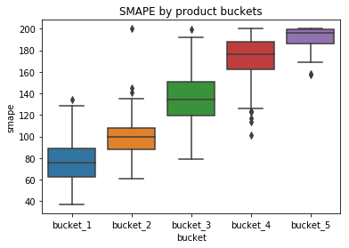

```python
# PREDICT PRODUCT QUANTITIES USING ML-based time series forecasting (LightGBM)

# import packages
import numpy as np
import pandas as pd
import matplotlib.pyplot as plt
%matplotlib inline
import seaborn as sns
import datetime
import zipfile
import lightgbm as lgb
import time

# set formatting
pd.set_option('display.max_columns', 500)
pd.set_option('display.max_rows', 700)
```


```python
def get_data(prod_id):
    df_orig = pd.read_csv(r"C:\Users\Vivek\Documents\meijer\\" + prod_id + ".csv.gz")
    return df_orig

def rename_cols(df_orig):
    rename_dict = {
       'ut_id' : 'store_id', 'p_id' : 'prod_id', 'day_dt' : 'date', 'mkt_bskt_ut_qt' : 'qty', 'adv_circ_flg' : 'adv_circ_flg', 
       'adv_mid_wk_flg' : 'adv_mid_wk_flg', 'adv_super_evnt_flg' : 'adv_super_evnt_flg', 'adv_dgtl_circ_flg' : 'adv_dgtl_circ_flg', 
       'unadv_flg' : 'adv_unadv_flg', 'pr_drop_flg' : 'adv_pr_drop_flg', 'p_ten_for_ten_flg' : 'adv_p_ten_for_ten_flg', 
       'ut_same_sto_flg' : 'ut_same_sto_flg', 'atl_min_temp_val' : 'weat_atl_min_temp_val', 'atl_mean_temp_val' : 'weat_atl_mean_temp_val', 
       'atl_max_temp_val' : 'weat_atl_max_temp_val', 'atl_t_ppt_qt' : 'weat_atl_t_ppt_qt', 'atl_t_snow_qt' : 'weat_atl_t_snow_qt', 
       'day_bef_ppt_temp_val' : 'weat_day_bef_ppt_temp_val', 'day_bef_snow_temp_val' : 'weat_day_bef_snow_temp_val', 
       'day_aft_ppt_temp_val' : 'weat_day_aft_ppt_temp_val', 'day_aft_snow_temp_val' : 'weat_day_aft_snow_temp_val', 
       'mpk_hook_flg' : 'mpk_hook_flg', 'mcc_hook_flg' : 'mcc_hook_flg', 'bucks_hook_flg' : 'bucks_hook_flg', 'other_hook_flg' : 'other_hook_flg', 
       'mpk_cpn_flg' : 'mpk_cpn_flg', 'sunprexmas' : 'hol_flg_sunprexmas', 'redsat' : 'hol_flg_redsat', 'blackfri' : 'hol_flg_blackfri', 
       'turkey' : 'hol_flg_turkey', 'saturdayb4turkey' : 'hol_flg_saturdayb4turkey', 'fridayb4turkey' : 'hol_flg_fridayb4turkey', 
       'veterans' : 'hol_flg_veterans', 'halloweenfri' : 'hol_flg_halloweenfri', 'halloween' : 'hol_flg_halloween', 
       'halloweeneve' : 'hol_flg_halloweeneve', 'prehalo_sun' : 'hol_flg_prehalo_sun', 'prehalo_fri' : 'hol_flg_prehalo_fri', 
       'columbus' : 'hol_flg_columbus', 'laborfri' : 'hol_flg_laborfri', 'laborsun' : 'hol_flg_laborsun', 'laborsat' : 'hol_flg_laborsat', 
       'laborwkend' : 'hol_flg_laborwkend', 'labor' : 'hol_flg_labor', 'dad' : 'hol_flg_dad', 'dadsat' : 'hol_flg_dadsat', 
       'memwkend' : 'hol_flg_memwkend', 'mom' : 'hol_flg_mom', 'momsat' : 'hol_flg_momsat', 'easterwk' : 'hol_flg_easterwk', 
       'easter' : 'hol_flg_easter', 'eastersat' : 'hol_flg_eastersat', 'presday' : 'hol_flg_presday', 'valentinewknd' : 
       'hol_flg_valentinewknd', 'valentine' : 'hol_flg_valentine', 'dayb4valentine' : 'hol_flg_dayb4valentine', 
       'superbowlsat' : 'hol_flg_superbowlsat', 'superbowl' : 'hol_flg_superbowl', 'mlk' : 'hol_flg_mlk', 'ny' : 'hol_flg_ny', 
       'julyfour' : 'hol_flg_julyfour', 'halloweenwkend' : 'hol_flg_halloweenwkend', 'dectwothree' : 'hol_flg_dectwothree', 
       'xmaseve' : 'hol_flg_xmaseve', 'satpny' : 'hol_flg_satpny', 'sunpny' : 'hol_flg_sunpny', 'memorial' : 'hol_flg_memorial', 
       'prehalo_sat' : 'hol_flg_prehalo_sat', 'turkeywed' : 'hol_flg_turkeywed', 'dectwosix' : 'hol_flg_dectwosix', 
       'mcc_blk_out' : 'hol_flg_mcc_blk_out', 'nyeve' : 'hol_flg_nyeve'
    }

    cols = ['store_id', 'prod_id', 'date', 'qty', 'adv_circ_flg', 'adv_mid_wk_flg', 'adv_super_evnt_flg', 
            'adv_dgtl_circ_flg', 'adv_unadv_flg', 'adv_pr_drop_flg', 'adv_p_ten_for_ten_flg', 
            'ut_same_sto_flg', 'weat_atl_min_temp_val', 'weat_atl_mean_temp_val', 'weat_atl_max_temp_val', 
            'weat_atl_t_ppt_qt', 'weat_atl_t_snow_qt', 'weat_day_bef_ppt_temp_val', 
            'weat_day_bef_snow_temp_val', 'weat_day_aft_ppt_temp_val', 'weat_day_aft_snow_temp_val', 
            'mpk_hook_flg', 'mcc_hook_flg', 'bucks_hook_flg', 'other_hook_flg', 'mpk_cpn_flg', 
            'hol_flg_sunprexmas', 'hol_flg_redsat', 'hol_flg_blackfri', 'hol_flg_turkey', 
            'hol_flg_saturdayb4turkey', 'hol_flg_fridayb4turkey', 'hol_flg_veterans', 
            'hol_flg_halloweenfri', 'hol_flg_halloween', 'hol_flg_halloweeneve', 'hol_flg_prehalo_sun', 
            'hol_flg_prehalo_fri', 'hol_flg_columbus', 'hol_flg_laborfri', 'hol_flg_laborsun', 
            'hol_flg_laborsat', 'hol_flg_laborwkend', 'hol_flg_labor', 'hol_flg_dad', 'hol_flg_dadsat', 
            'hol_flg_memwkend', 'hol_flg_mom', 'hol_flg_momsat', 'hol_flg_easterwk', 'hol_flg_easter', 
            'hol_flg_eastersat', 'hol_flg_presday', 'hol_flg_valentinewknd', 'hol_flg_valentine', 
            'hol_flg_dayb4valentine', 'hol_flg_superbowlsat', 'hol_flg_superbowl', 'hol_flg_mlk', 
            'hol_flg_ny', 'hol_flg_julyfour', 'hol_flg_halloweenwkend', 'hol_flg_dectwothree', 
            'hol_flg_xmaseve', 'hol_flg_satpny', 'hol_flg_sunpny', 'hol_flg_memorial', 
            'hol_flg_prehalo_sat', 'hol_flg_turkeywed', 'hol_flg_dectwosix', 'hol_flg_mcc_blk_out', 
            'hol_flg_nyeve']

    df = df_orig
    df.columns = df.columns.str.lower()
    df = df.rename(columns = rename_dict)
    df = df[cols]
    df['date'] = pd.to_datetime(df['date'])
    
    return df
```


```python
def create_features(df):
    # create new date based cols part 1
    # idea to make it more modular: make 'date' a variable
    # optional 'dt_' prefix

    df['dt_days_from_2k'] = (df['date'] - pd.to_datetime('2000-01-01')).dt.days
    df['dt_week_of_month'] = df['date'].apply(lambda d: (d.day-1) // 7 + 1)
    df['dt_week_of_year'] = df['date'].dt.week
    df['dt_year'] = df['date'].dt.year
    df['dt_month'] = df['date'].dt.month
    df['dt_day_of_month'] = df['date'].dt.day
    df['dt_day_of_week'] = df['date'].dt.dayofweek
    df['dt_day_of_year'] = df['date'].dt.dayofyear

    # create new date based cols part 2
    # more modular: make function which returns '_sin', '_cos' cols given col_name
    # 366, 7, 53 should be determined using max of columns

    df['dt_day_of_year_sin'] = np.sin(2*np.pi*(df['dt_day_of_year']/366))
    df['dt_day_of_year_cos'] = np.cos(2*np.pi*(df['dt_day_of_year']/366))

    df['dt_day_of_week_sin'] = np.sin(2*np.pi*(df['dt_day_of_week']/7))
    df['dt_day_of_week_cos'] = np.cos(2*np.pi*(df['dt_day_of_week']/7))

    df['dt_week_of_year_sin'] = np.sin(2*np.pi*(df['dt_week_of_year']/53))
    df['dt_week_of_year_cos'] = np.cos(2*np.pi*(df['dt_week_of_year']/53))

    df['dt_day_of_month_sin'] = np.sin(2*np.pi*(df['dt_day_of_month']/31))
    df['dt_day_of_month_cos'] = np.cos(2*np.pi*(df['dt_day_of_month']/31))

    df['dt_month_sin'] = np.sin(2*np.pi*(df['dt_month']/12))
    df['dt_month_cos'] = np.cos(2*np.pi*(df['dt_month']/12))
    
    return df
```


```python
# shuffle the dataframe rows

def shuffle_df(df):
    df = df.reindex(np.random.permutation(df.index))
    df = df.sort_values(by=['date'])
    
    return df
```


```python
# functions to create lag variables, moving average variables, aggregate variables


def create_lag_vars(df, tgt_col, lags = [7, 14, 28, 56], grpby_cols = ['store_id']):
  grpby = df.groupby(grpby_cols)
  for lag in lags:
    new_col = tgt_col + '_' + 'lag' + '_' + str(lag)
    df[new_col] = grpby[tgt_col].shift(lag)
  
  return df


def create_lag_same_day_last_yr(df, tgt_col, month_col = 'dt_month', 
                            day_col = 'dt_day_of_month', grpby_cols = ['store_id']):
  grpby = df.groupby(grpby_cols + [month_col, day_col])
  new_col = tgt_col + '_' + 'lag_last_yr'
  df[new_col] = grpby[tgt_col].shift(1)
  
  return df


def create_ma_vars(df, tgt_col, lag = 7, windows = [4, 5, 7, 10, 14, 18, 30], grpby_cols = ['store_id']):
  grpby = df.groupby(grpby_cols)
  for window in windows:
    new_col = tgt_col + '_lag_' + str(lag) + '_ma_' + str(window)
    df[new_col] = grpby[tgt_col].shift(lag).rolling(window).mean()
  
  return df


def create_agg_vars(df, grpby_cols = ['date'], 
                    agg_ops = [('qty_mean_prod_dt', 'qty', np.mean), 
                               ('qty_median_prod_dt', 'qty', np.median),
                               ('stor_unique', 'store_id', pd.Series.nunique)]):
  grpby = df.groupby(grpby_cols)
  for col_name, tgt, agg_func in agg_ops:
    df_temp = grpby[tgt].agg(agg_func).reset_index().shift()
    df_temp.rename(columns={tgt:col_name}, inplace=True)
    df = pd.merge(df, df_temp, how='left', on=grpby_cols)
  
  return df
```


```python
def create_all_lagged_features(df):
    df = create_lag_vars(df, tgt_col = 'qty')
    # df = create_lag_same_day_last_yr(df, tgt_col = 'qty')
    df = create_ma_vars(df, tgt_col = 'qty')
    df = create_agg_vars(df, grpby_cols=['date'])
    df = create_lag_vars(df, tgt_col = 'qty_mean_prod_dt')
    # df = create_agg_vars_v2(df)

    df = create_ma_vars(df, tgt_col = 'qty_mean_prod_dt')
    # df = create_ma_vars(df, tgt_col = 'qty_mean_day_of_wk_mth')
    # df.head()

    df = create_lag_vars(df, tgt_col = 'qty_mean_prod_dt')
    df = create_lag_vars(df, tgt_col = 'qty_median_prod_dt')

    return df
```


```python
# dummy vars function, transforming y, creating train_test, and calucalting SMAPE

def create_dummies(df):
    dummy_cols = ['store_id', 'dt_week_of_month', 'dt_week_of_year', 'dt_month', 
                  'dt_day_of_month', 'dt_day_of_week', 'ut_same_sto_flg']
    df_dummy = pd.get_dummies(df, columns = dummy_cols, prefix = dummy_cols, dummy_na=True)
    
    return df_dummy

def transform_y(df_dummy):
    df_dummy['qty_log_1p'] = np.log1p(df_dummy['qty'].values)
    df_dummy['qty_capped_8'] = df_dummy['qty'].apply(lambda x: 8 if x >= 8 else x)
    
    return df_dummy

def create_train_test(df_dummy):
    train = df_dummy[(df_dummy['date']>='2015-03-02') & (df_dummy['date']<='2018-10-02')]
    test = df_dummy[(df_dummy['date']>'2018-10-02')]
    
    return (train, test)

def smape(preds, target):
    '''
    Function to calculate SMAPE
    '''
    n = len(preds)
    masked_arr = ~((preds==0)&(target==0))
    preds, target = preds[masked_arr], target[masked_arr]
    num = np.abs(preds-target)
    denom = np.abs(preds)+np.abs(target)
    smape_val = (200*np.sum(num/denom))/n
    return smape_val

def lgbm_smape(preds, train_data):
    '''
    Custom Evaluation Function for LGBM
    '''
    labels = train_data.get_label()
#     smape_val = smape(np.expm1(preds), np.expm1(labels))
    smape_val = smape(preds, labels)
    return 'SMAPE', smape_val, False


```


```python
# cycle through dir and find appropriate data files

import os
prod_list = []
for file in os.listdir("./Bucket 4/"):
    if file.endswith(".csv.gz"):
        prod_list.append(os.path.join(file)[:-7])
        print(os.path.join(file)[:-7])
```

    bucket_4_472556
    bucket_4_472875
    bucket_4_473137
    bucket_4_473658
    bucket_4_473772
    bucket_4_474845
    bucket_4_475037
    bucket_4_476385
    bucket_4_476662
    bucket_4_477591
    bucket_4_478125
    bucket_4_479709
    bucket_4_480318
    bucket_4_480374
    bucket_4_480461
    bucket_4_481228
    bucket_4_482173
    bucket_4_482329
    bucket_4_482760
    bucket_4_484290
    bucket_4_484597
    bucket_4_484987
    bucket_4_486076
    bucket_4_486668
    bucket_4_489369
    bucket_4_489608
    bucket_4_489660
    


```python
prod_list
```


    ['bucket_4_472556',
     'bucket_4_472875',
     'bucket_4_473137',
     'bucket_4_473658',
     'bucket_4_473772',
     'bucket_4_474845',
     'bucket_4_475037',
     'bucket_4_476385',
     'bucket_4_476662',
     'bucket_4_477591',
     'bucket_4_478125',
     'bucket_4_479709',
     'bucket_4_480318',
     'bucket_4_480374',
     'bucket_4_480461',
     'bucket_4_481228',
     'bucket_4_482173',
     'bucket_4_482329',
     'bucket_4_482760',
     'bucket_4_484290',
     'bucket_4_484597',
     'bucket_4_484987',
     'bucket_4_486076',
     'bucket_4_486668',
     'bucket_4_489369',
     'bucket_4_489608',
     'bucket_4_489660']


```python
train_x.head()
```


<div>
<style scoped>
    .dataframe tbody tr th:only-of-type {
        vertical-align: middle;
    }

    .dataframe tbody tr th {
        vertical-align: top;
    }

    .dataframe thead th {
        text-align: right;
    }
</style>
<table border="1" class="dataframe">
  <thead>
    <tr style="text-align: right;">
      <th></th>
      <th>store_id</th>
      <th>adv_circ_flg</th>
      <th>adv_mid_wk_flg</th>
      <th>adv_super_evnt_flg</th>
      <th>adv_dgtl_circ_flg</th>
      <th>adv_unadv_flg</th>
      <th>adv_pr_drop_flg</th>
      <th>adv_p_ten_for_ten_flg</th>
      <th>weat_atl_min_temp_val</th>
      <th>weat_atl_mean_temp_val</th>
      <th>weat_atl_max_temp_val</th>
      <th>weat_atl_t_ppt_qt</th>
      <th>weat_atl_t_snow_qt</th>
      <th>weat_day_bef_ppt_temp_val</th>
      <th>weat_day_bef_snow_temp_val</th>
      <th>weat_day_aft_ppt_temp_val</th>
      <th>weat_day_aft_snow_temp_val</th>
      <th>mpk_hook_flg</th>
      <th>mcc_hook_flg</th>
      <th>bucks_hook_flg</th>
      <th>other_hook_flg</th>
      <th>mpk_cpn_flg</th>
      <th>hol_flg_sunprexmas</th>
      <th>hol_flg_redsat</th>
      <th>hol_flg_blackfri</th>
      <th>hol_flg_turkey</th>
      <th>hol_flg_saturdayb4turkey</th>
      <th>hol_flg_fridayb4turkey</th>
      <th>hol_flg_veterans</th>
      <th>hol_flg_halloweenfri</th>
      <th>hol_flg_halloween</th>
      <th>hol_flg_halloweeneve</th>
      <th>hol_flg_prehalo_sun</th>
      <th>hol_flg_prehalo_fri</th>
      <th>hol_flg_columbus</th>
      <th>hol_flg_laborfri</th>
      <th>hol_flg_laborsun</th>
      <th>hol_flg_laborsat</th>
      <th>hol_flg_laborwkend</th>
      <th>hol_flg_labor</th>
      <th>hol_flg_dad</th>
      <th>hol_flg_dadsat</th>
      <th>hol_flg_memwkend</th>
      <th>hol_flg_mom</th>
      <th>hol_flg_momsat</th>
      <th>hol_flg_easterwk</th>
      <th>hol_flg_easter</th>
      <th>hol_flg_eastersat</th>
      <th>hol_flg_presday</th>
      <th>hol_flg_valentinewknd</th>
      <th>hol_flg_valentine</th>
      <th>hol_flg_dayb4valentine</th>
      <th>hol_flg_superbowlsat</th>
      <th>hol_flg_superbowl</th>
      <th>hol_flg_mlk</th>
      <th>hol_flg_ny</th>
      <th>hol_flg_julyfour</th>
      <th>hol_flg_halloweenwkend</th>
      <th>hol_flg_dectwothree</th>
      <th>hol_flg_xmaseve</th>
      <th>hol_flg_satpny</th>
      <th>hol_flg_sunpny</th>
      <th>hol_flg_memorial</th>
      <th>hol_flg_prehalo_sat</th>
      <th>hol_flg_turkeywed</th>
      <th>hol_flg_dectwosix</th>
      <th>hol_flg_mcc_blk_out</th>
      <th>hol_flg_nyeve</th>
      <th>dt_week_of_month</th>
      <th>dt_week_of_year</th>
      <th>dt_month</th>
      <th>dt_day_of_month</th>
      <th>dt_day_of_week</th>
      <th>dt_day_of_year</th>
      <th>dt_day_of_year_sin</th>
      <th>dt_day_of_year_cos</th>
      <th>dt_day_of_week_sin</th>
      <th>dt_day_of_week_cos</th>
      <th>dt_week_of_year_sin</th>
      <th>dt_week_of_year_cos</th>
      <th>dt_day_of_month_sin</th>
      <th>dt_day_of_month_cos</th>
      <th>dt_month_sin</th>
      <th>dt_month_cos</th>
      <th>qty_lag_7</th>
      <th>qty_lag_14</th>
      <th>qty_lag_28</th>
      <th>qty_lag_56</th>
      <th>qty_lag_7_ma_4</th>
      <th>qty_lag_7_ma_5</th>
      <th>qty_lag_7_ma_7</th>
      <th>qty_lag_7_ma_10</th>
      <th>qty_lag_7_ma_14</th>
      <th>qty_lag_7_ma_18</th>
      <th>qty_lag_7_ma_30</th>
      <th>qty_mean_prod_dt_lag_7</th>
      <th>qty_mean_prod_dt_lag_14</th>
      <th>qty_mean_prod_dt_lag_28</th>
      <th>qty_mean_prod_dt_lag_56</th>
      <th>qty_mean_prod_dt_lag_7_ma_4</th>
      <th>qty_mean_prod_dt_lag_7_ma_5</th>
      <th>qty_mean_prod_dt_lag_7_ma_7</th>
      <th>qty_mean_prod_dt_lag_7_ma_10</th>
      <th>qty_mean_prod_dt_lag_7_ma_14</th>
      <th>qty_mean_prod_dt_lag_7_ma_18</th>
      <th>qty_mean_prod_dt_lag_7_ma_30</th>
      <th>qty_median_prod_dt_lag_7</th>
      <th>qty_median_prod_dt_lag_14</th>
      <th>qty_median_prod_dt_lag_28</th>
      <th>qty_median_prod_dt_lag_56</th>
    </tr>
  </thead>
  <tbody>
    <tr>
      <th>521</th>
      <td>113</td>
      <td>0.0</td>
      <td>0.0</td>
      <td>0.0</td>
      <td>0.0</td>
      <td>0.0</td>
      <td>0.0</td>
      <td>0.0</td>
      <td>12.9</td>
      <td>21.45</td>
      <td>30.0</td>
      <td>0.0</td>
      <td>0.1</td>
      <td>0.25</td>
      <td>2.9</td>
      <td>0.01</td>
      <td>0.4</td>
      <td>0.0</td>
      <td>0.0</td>
      <td>0.0</td>
      <td>0.0</td>
      <td>0.0</td>
      <td>0.0</td>
      <td>0.0</td>
      <td>0.0</td>
      <td>0.0</td>
      <td>0.0</td>
      <td>0.0</td>
      <td>0.0</td>
      <td>0.0</td>
      <td>0.0</td>
      <td>0.0</td>
      <td>0.0</td>
      <td>0.0</td>
      <td>0.0</td>
      <td>0.0</td>
      <td>0.0</td>
      <td>0.0</td>
      <td>0.0</td>
      <td>0.0</td>
      <td>0.0</td>
      <td>0.0</td>
      <td>0.0</td>
      <td>0.0</td>
      <td>0.0</td>
      <td>0.0</td>
      <td>0.0</td>
      <td>0.0</td>
      <td>0.0</td>
      <td>0.0</td>
      <td>0.0</td>
      <td>0.0</td>
      <td>0.0</td>
      <td>0.0</td>
      <td>0.0</td>
      <td>0.0</td>
      <td>0.0</td>
      <td>0.0</td>
      <td>0.0</td>
      <td>0.0</td>
      <td>0.0</td>
      <td>0.0</td>
      <td>0.0</td>
      <td>0.0</td>
      <td>0.0</td>
      <td>0.0</td>
      <td>0.0</td>
      <td>0.0</td>
      <td>1</td>
      <td>10</td>
      <td>3</td>
      <td>2</td>
      <td>0</td>
      <td>61</td>
      <td>0.866025</td>
      <td>0.5</td>
      <td>0.0</td>
      <td>1.0</td>
      <td>0.92669</td>
      <td>0.375828</td>
      <td>0.394356</td>
      <td>0.918958</td>
      <td>1.0</td>
      <td>6.123234e-17</td>
      <td>0.0</td>
      <td>0.0</td>
      <td>0.0</td>
      <td>0.0</td>
      <td>2.25</td>
      <td>1.8</td>
      <td>1.285714</td>
      <td>1.3</td>
      <td>1.000000</td>
      <td>0.944444</td>
      <td>0.800000</td>
      <td>0.1</td>
      <td>0.6</td>
      <td>0.333333</td>
      <td>0.25</td>
      <td>1.0</td>
      <td>1.06</td>
      <td>1.128571</td>
      <td>1.18</td>
      <td>1.021429</td>
      <td>0.883333</td>
      <td>0.78</td>
      <td>0.0</td>
      <td>0.0</td>
      <td>0.0</td>
      <td>0.0</td>
    </tr>
    <tr>
      <th>522</th>
      <td>115</td>
      <td>0.0</td>
      <td>0.0</td>
      <td>0.0</td>
      <td>0.0</td>
      <td>0.0</td>
      <td>0.0</td>
      <td>0.0</td>
      <td>7.0</td>
      <td>17.50</td>
      <td>28.0</td>
      <td>0.0</td>
      <td>0.0</td>
      <td>0.08</td>
      <td>0.2</td>
      <td>0.24</td>
      <td>4.1</td>
      <td>0.0</td>
      <td>0.0</td>
      <td>0.0</td>
      <td>0.0</td>
      <td>0.0</td>
      <td>0.0</td>
      <td>0.0</td>
      <td>0.0</td>
      <td>0.0</td>
      <td>0.0</td>
      <td>0.0</td>
      <td>0.0</td>
      <td>0.0</td>
      <td>0.0</td>
      <td>0.0</td>
      <td>0.0</td>
      <td>0.0</td>
      <td>0.0</td>
      <td>0.0</td>
      <td>0.0</td>
      <td>0.0</td>
      <td>0.0</td>
      <td>0.0</td>
      <td>0.0</td>
      <td>0.0</td>
      <td>0.0</td>
      <td>0.0</td>
      <td>0.0</td>
      <td>0.0</td>
      <td>0.0</td>
      <td>0.0</td>
      <td>0.0</td>
      <td>0.0</td>
      <td>0.0</td>
      <td>0.0</td>
      <td>0.0</td>
      <td>0.0</td>
      <td>0.0</td>
      <td>0.0</td>
      <td>0.0</td>
      <td>0.0</td>
      <td>0.0</td>
      <td>0.0</td>
      <td>0.0</td>
      <td>0.0</td>
      <td>0.0</td>
      <td>0.0</td>
      <td>0.0</td>
      <td>0.0</td>
      <td>0.0</td>
      <td>0.0</td>
      <td>1</td>
      <td>10</td>
      <td>3</td>
      <td>2</td>
      <td>0</td>
      <td>61</td>
      <td>0.866025</td>
      <td>0.5</td>
      <td>0.0</td>
      <td>1.0</td>
      <td>0.92669</td>
      <td>0.375828</td>
      <td>0.394356</td>
      <td>0.918958</td>
      <td>1.0</td>
      <td>6.123234e-17</td>
      <td>1.0</td>
      <td>1.0</td>
      <td>0.0</td>
      <td>1.0</td>
      <td>1.00</td>
      <td>2.0</td>
      <td>1.428571</td>
      <td>1.1</td>
      <td>1.071429</td>
      <td>1.000000</td>
      <td>0.833333</td>
      <td>0.1</td>
      <td>0.6</td>
      <td>0.333333</td>
      <td>0.25</td>
      <td>0.7</td>
      <td>0.82</td>
      <td>0.957143</td>
      <td>1.06</td>
      <td>1.000000</td>
      <td>0.866667</td>
      <td>0.76</td>
      <td>0.0</td>
      <td>0.0</td>
      <td>0.0</td>
      <td>0.0</td>
    </tr>
    <tr>
      <th>523</th>
      <td>112</td>
      <td>0.0</td>
      <td>0.0</td>
      <td>0.0</td>
      <td>0.0</td>
      <td>0.0</td>
      <td>0.0</td>
      <td>0.0</td>
      <td>15.1</td>
      <td>22.55</td>
      <td>30.0</td>
      <td>0.0</td>
      <td>0.0</td>
      <td>0.32</td>
      <td>0.0</td>
      <td>0.40</td>
      <td>4.5</td>
      <td>0.0</td>
      <td>0.0</td>
      <td>0.0</td>
      <td>0.0</td>
      <td>0.0</td>
      <td>0.0</td>
      <td>0.0</td>
      <td>0.0</td>
      <td>0.0</td>
      <td>0.0</td>
      <td>0.0</td>
      <td>0.0</td>
      <td>0.0</td>
      <td>0.0</td>
      <td>0.0</td>
      <td>0.0</td>
      <td>0.0</td>
      <td>0.0</td>
      <td>0.0</td>
      <td>0.0</td>
      <td>0.0</td>
      <td>0.0</td>
      <td>0.0</td>
      <td>0.0</td>
      <td>0.0</td>
      <td>0.0</td>
      <td>0.0</td>
      <td>0.0</td>
      <td>0.0</td>
      <td>0.0</td>
      <td>0.0</td>
      <td>0.0</td>
      <td>0.0</td>
      <td>0.0</td>
      <td>0.0</td>
      <td>0.0</td>
      <td>0.0</td>
      <td>0.0</td>
      <td>0.0</td>
      <td>0.0</td>
      <td>0.0</td>
      <td>0.0</td>
      <td>0.0</td>
      <td>0.0</td>
      <td>0.0</td>
      <td>0.0</td>
      <td>0.0</td>
      <td>0.0</td>
      <td>0.0</td>
      <td>0.0</td>
      <td>0.0</td>
      <td>1</td>
      <td>10</td>
      <td>3</td>
      <td>2</td>
      <td>0</td>
      <td>61</td>
      <td>0.866025</td>
      <td>0.5</td>
      <td>0.0</td>
      <td>1.0</td>
      <td>0.92669</td>
      <td>0.375828</td>
      <td>0.394356</td>
      <td>0.918958</td>
      <td>1.0</td>
      <td>6.123234e-17</td>
      <td>0.0</td>
      <td>0.0</td>
      <td>0.0</td>
      <td>0.0</td>
      <td>0.50</td>
      <td>0.8</td>
      <td>1.428571</td>
      <td>1.0</td>
      <td>1.071429</td>
      <td>0.888889</td>
      <td>0.833333</td>
      <td>0.1</td>
      <td>0.6</td>
      <td>0.333333</td>
      <td>0.25</td>
      <td>0.4</td>
      <td>0.58</td>
      <td>0.785714</td>
      <td>0.94</td>
      <td>0.978571</td>
      <td>0.850000</td>
      <td>0.74</td>
      <td>0.0</td>
      <td>0.0</td>
      <td>0.0</td>
      <td>0.0</td>
    </tr>
    <tr>
      <th>524</th>
      <td>120</td>
      <td>0.0</td>
      <td>0.0</td>
      <td>0.0</td>
      <td>0.0</td>
      <td>0.0</td>
      <td>0.0</td>
      <td>0.0</td>
      <td>8.1</td>
      <td>20.05</td>
      <td>32.0</td>
      <td>0.0</td>
      <td>0.0</td>
      <td>0.05</td>
      <td>0.1</td>
      <td>0.07</td>
      <td>1.2</td>
      <td>0.0</td>
      <td>0.0</td>
      <td>0.0</td>
      <td>0.0</td>
      <td>0.0</td>
      <td>0.0</td>
      <td>0.0</td>
      <td>0.0</td>
      <td>0.0</td>
      <td>0.0</td>
      <td>0.0</td>
      <td>0.0</td>
      <td>0.0</td>
      <td>0.0</td>
      <td>0.0</td>
      <td>0.0</td>
      <td>0.0</td>
      <td>0.0</td>
      <td>0.0</td>
      <td>0.0</td>
      <td>0.0</td>
      <td>0.0</td>
      <td>0.0</td>
      <td>0.0</td>
      <td>0.0</td>
      <td>0.0</td>
      <td>0.0</td>
      <td>0.0</td>
      <td>0.0</td>
      <td>0.0</td>
      <td>0.0</td>
      <td>0.0</td>
      <td>0.0</td>
      <td>0.0</td>
      <td>0.0</td>
      <td>0.0</td>
      <td>0.0</td>
      <td>0.0</td>
      <td>0.0</td>
      <td>0.0</td>
      <td>0.0</td>
      <td>0.0</td>
      <td>0.0</td>
      <td>0.0</td>
      <td>0.0</td>
      <td>0.0</td>
      <td>0.0</td>
      <td>0.0</td>
      <td>0.0</td>
      <td>0.0</td>
      <td>0.0</td>
      <td>1</td>
      <td>10</td>
      <td>3</td>
      <td>2</td>
      <td>0</td>
      <td>61</td>
      <td>0.866025</td>
      <td>0.5</td>
      <td>0.0</td>
      <td>1.0</td>
      <td>0.92669</td>
      <td>0.375828</td>
      <td>0.394356</td>
      <td>0.918958</td>
      <td>1.0</td>
      <td>6.123234e-17</td>
      <td>0.0</td>
      <td>1.0</td>
      <td>1.0</td>
      <td>0.0</td>
      <td>0.25</td>
      <td>0.4</td>
      <td>1.428571</td>
      <td>1.0</td>
      <td>1.000000</td>
      <td>0.888889</td>
      <td>0.733333</td>
      <td>0.1</td>
      <td>0.6</td>
      <td>0.333333</td>
      <td>0.25</td>
      <td>0.1</td>
      <td>0.34</td>
      <td>0.614286</td>
      <td>0.82</td>
      <td>0.957143</td>
      <td>0.833333</td>
      <td>0.72</td>
      <td>0.0</td>
      <td>0.0</td>
      <td>0.0</td>
      <td>0.0</td>
    </tr>
    <tr>
      <th>525</th>
      <td>119</td>
      <td>0.0</td>
      <td>0.0</td>
      <td>0.0</td>
      <td>0.0</td>
      <td>0.0</td>
      <td>0.0</td>
      <td>0.0</td>
      <td>12.0</td>
      <td>21.00</td>
      <td>30.0</td>
      <td>0.0</td>
      <td>0.0</td>
      <td>0.00</td>
      <td>2.9</td>
      <td>0.00</td>
      <td>0.2</td>
      <td>0.0</td>
      <td>0.0</td>
      <td>0.0</td>
      <td>0.0</td>
      <td>0.0</td>
      <td>0.0</td>
      <td>0.0</td>
      <td>0.0</td>
      <td>0.0</td>
      <td>0.0</td>
      <td>0.0</td>
      <td>0.0</td>
      <td>0.0</td>
      <td>0.0</td>
      <td>0.0</td>
      <td>0.0</td>
      <td>0.0</td>
      <td>0.0</td>
      <td>0.0</td>
      <td>0.0</td>
      <td>0.0</td>
      <td>0.0</td>
      <td>0.0</td>
      <td>0.0</td>
      <td>0.0</td>
      <td>0.0</td>
      <td>0.0</td>
      <td>0.0</td>
      <td>0.0</td>
      <td>0.0</td>
      <td>0.0</td>
      <td>0.0</td>
      <td>0.0</td>
      <td>0.0</td>
      <td>0.0</td>
      <td>0.0</td>
      <td>0.0</td>
      <td>0.0</td>
      <td>0.0</td>
      <td>0.0</td>
      <td>0.0</td>
      <td>0.0</td>
      <td>0.0</td>
      <td>0.0</td>
      <td>0.0</td>
      <td>0.0</td>
      <td>0.0</td>
      <td>0.0</td>
      <td>0.0</td>
      <td>0.0</td>
      <td>0.0</td>
      <td>1</td>
      <td>10</td>
      <td>3</td>
      <td>2</td>
      <td>0</td>
      <td>61</td>
      <td>0.866025</td>
      <td>0.5</td>
      <td>0.0</td>
      <td>1.0</td>
      <td>0.92669</td>
      <td>0.375828</td>
      <td>0.394356</td>
      <td>0.918958</td>
      <td>1.0</td>
      <td>6.123234e-17</td>
      <td>0.0</td>
      <td>3.0</td>
      <td>1.0</td>
      <td>1.0</td>
      <td>0.25</td>
      <td>0.2</td>
      <td>0.571429</td>
      <td>1.0</td>
      <td>1.000000</td>
      <td>0.833333</td>
      <td>0.733333</td>
      <td>0.1</td>
      <td>0.6</td>
      <td>0.333333</td>
      <td>0.25</td>
      <td>0.1</td>
      <td>0.10</td>
      <td>0.442857</td>
      <td>0.70</td>
      <td>0.871429</td>
      <td>0.816667</td>
      <td>0.70</td>
      <td>0.0</td>
      <td>0.0</td>
      <td>0.0</td>
      <td>0.0</td>
    </tr>
  </tbody>
</table>
</div>


```python
# main data loop which goes through each product, builds LGBM model and generates error metrics

for prod_id in prod_list:
    
    print('prod:' + prod_id + ' started...')
    
    if os.path.isfile(prod_id + '_results.csv'):
        print('prod:' + prod_id + ' results file exists - skip...')
        continue
    df_orig = get_data(prod_id)
    df = rename_cols(df_orig)
    print('prod:' + prod_id + ' loaded & renamed dataset...')
    print(df.date.min(), df.date.max())
    if not ((df.date.min() == pd.to_datetime('2015-01-02')) and (df.date.max() == pd.to_datetime('2018-12-22'))):
        print('prod:' + prod_id + 'dates not correctly bounded...')
        continue

    df = create_features(df)
    df = shuffle_df(df)
    print('prod:' + prod_id + ' created features and shuffled...')
    df = create_all_lagged_features(df)
    df_dummies = create_dummies(df)
    df_dummies = transform_y(df)
    
    print('prod:' + prod_id + ' created dummies & transformed y...')

    train, test = create_train_test(df_dummies)

    no_cols = ['prod_id', 'date', 'qty', 'dt_days_from_2k', 'dt_year', 'qty_mean_prod_dt',
               'qty_median_prod_dt', 'stor_unique', 'qty_log_1p', 'qty_capped_8', 'ut_same_sto_flg']

    cols = [col for col in train.columns if col not in no_cols]

    train_x = train[[col for col in train.columns if col not in no_cols]]
    train_y = train[['date', 'qty']]
    test_x = test[[col for col in test.columns if col not in no_cols]]
    test_y = test[['date', 'qty']]

    train_x_val = train_x.values
    train_y_val = (train_y['qty'] + 1).values
    test_x_val = test_x.values
    test_y_val = (test_y['qty'] + 1).values

    # Creating lgbtrain & lgbval
    lgbtrain = lgb.Dataset(data=train_x_val, label=train_y_val, 
                           feature_name=cols)
    lgbval = lgb.Dataset(data=test_x_val, label=test_y_val, 
                         reference=lgbtrain, feature_name=cols)

    print('prod:' + prod_id + ' created lgbm datasets...')
    
    lgb_params = {'task':'train', 'boosting_type':'gbdt', 'objective':'regression', 
                  'metric': {'rmse'}, 'num_leaves': 60, 'learning_rate': 0.005, 
                  'feature_fraction': 0.7, 'max_depth': 12, 'verbose': 0, 
                  'num_boost_round':1500, 'early_stopping_rounds':200, 'nthread':-1,
                  'min_data_in_leaf': 5}

    def lgb_validation(params, lgbtrain, lgbval, X_val, Y_val, verbose_eval):
        t0 = time.time()
        evals_result = {}
        model = lgb.train(params, lgbtrain, num_boost_round=params['num_boost_round'], 
                          valid_sets=[lgbtrain, lgbval], feval=lgbm_smape, 
                          early_stopping_rounds=params['early_stopping_rounds'], 
                          evals_result=evals_result, verbose_eval=verbose_eval)
        print(model.best_iteration)
        print('Total time taken to build the model: ', (time.time()-t0)/60, 'minutes!!')
        pred_Y_val = model.predict(X_val, num_iteration=model.best_iteration)
        pred_Y_val = (pred_Y_val)
        Y_val = (Y_val)
        val_df = pd.DataFrame(columns=['true_Y_val','pred_Y_val'])
        val_df['pred_Y_val'] = pred_Y_val
        val_df['true_Y_val'] = Y_val
        print(val_df.shape)
        print(val_df.sample(5))
        print('SMAPE for validation data is:{}'.format(smape(pred_Y_val, Y_val)))

        return model, val_df

    # Training lightgbm model and validating
    model, val_df = lgb_validation(lgb_params, lgbtrain, lgbval, test_x_val, 
                                   test_y_val, verbose_eval=5000)


    print('prod:' + prod_id + ' model trained...')
    
    pred_rows = df_dummies[(df_dummies['date']>'2018-10-02')].shape[0]
    stores = df.iloc[-pred_rows:].store_id.reset_index(drop=True)
    errors = pd.concat([stores, val_df], axis='columns')
    errors['prod_id'] = prod_id

    write_df = errors.groupby(['store_id', 'prod_id']).apply(lambda x: smape(x['pred_Y_val'], x['true_Y_val'])).reset_index().rename(columns={0:'smape'})
    
    print('prod:' + prod_id + ' writing results...')
    write_df.to_csv(prod_id + '_results.csv', index=False)
    
    print('prod:' + prod_id + ' done...')

print('All products done!')
```

    prod:bucket_4_472556 started...
    prod:bucket_4_472556 loaded & renamed dataset...
    2015-01-02 00:00:00 2018-12-22 00:00:00
    prod:bucket_4_472556 created features and shuffled...
    prod:bucket_4_472556 created dummies & transformed y...
    prod:bucket_4_472556 created lgbm datasets...
    Training until validation scores don't improve for 200 rounds.
    

    C:\Users\Vivek\Anaconda3\lib\site-packages\lightgbm\engine.py:99: UserWarning: Found `num_boost_round` in params. Will use it instead of argument
      warnings.warn("Found `{}` in params. Will use it instead of argument".format(alias))
    C:\Users\Vivek\Anaconda3\lib\site-packages\lightgbm\engine.py:104: UserWarning: Found `early_stopping_rounds` in params. Will use it instead of argument
      warnings.warn("Found `{}` in params. Will use it instead of argument".format(alias))
    

    Early stopping, best iteration is:
    [425]	training's rmse: 1.09811	training's SMAPE: 36.0914	valid_1's rmse: 1.31578	valid_1's SMAPE: 38.4541
    425
    Total time taken to build the model:  0.11063334544499716 minutes!!
    (810, 2)
         true_Y_val  pred_Y_val
    341         1.0    1.337435
    788         1.0    1.278631
    318         1.0    1.333821
    508         1.0    1.317324
    528         1.0    1.307049
    SMAPE for validation data is:38.45407384543719
    prod:bucket_4_472556 model trained...
    prod:bucket_4_472556 writing results...
    prod:bucket_4_472556 done...
    prod:bucket_4_472875 started...
    prod:bucket_4_472875 loaded & renamed dataset...
    2015-01-02 00:00:00 2018-12-22 00:00:00
    prod:bucket_4_472875 created features and shuffled...
    prod:bucket_4_472875 created dummies & transformed y...
    prod:bucket_4_472875 created lgbm datasets...
    Training until validation scores don't improve for 200 rounds.
    

    C:\Users\Vivek\Anaconda3\lib\site-packages\lightgbm\engine.py:99: UserWarning: Found `num_boost_round` in params. Will use it instead of argument
      warnings.warn("Found `{}` in params. Will use it instead of argument".format(alias))
    C:\Users\Vivek\Anaconda3\lib\site-packages\lightgbm\engine.py:104: UserWarning: Found `early_stopping_rounds` in params. Will use it instead of argument
      warnings.warn("Found `{}` in params. Will use it instead of argument".format(alias))
    

    Early stopping, best iteration is:
    [832]	training's rmse: 0.729548	training's SMAPE: 30.7364	valid_1's rmse: 1.12973	valid_1's SMAPE: 33.3014
    832
    Total time taken to build the model:  0.21198341846466065 minutes!!
    (810, 2)
         true_Y_val  pred_Y_val
    100         2.0    2.773007
    335         5.0    3.900114
    375         2.0    3.516924
    303         2.0    1.437559
    619         1.0    1.366499
    SMAPE for validation data is:33.30141835927363
    prod:bucket_4_472875 model trained...
    prod:bucket_4_472875 writing results...
    prod:bucket_4_472875 done...
    prod:bucket_4_473137 started...
    prod:bucket_4_473137 loaded & renamed dataset...
    2015-01-02 00:00:00 2018-12-22 00:00:00
    prod:bucket_4_473137 created features and shuffled...
    prod:bucket_4_473137 created dummies & transformed y...
    prod:bucket_4_473137 created lgbm datasets...
    

    C:\Users\Vivek\Anaconda3\lib\site-packages\lightgbm\engine.py:99: UserWarning: Found `num_boost_round` in params. Will use it instead of argument
      warnings.warn("Found `{}` in params. Will use it instead of argument".format(alias))
    C:\Users\Vivek\Anaconda3\lib\site-packages\lightgbm\engine.py:104: UserWarning: Found `early_stopping_rounds` in params. Will use it instead of argument
      warnings.warn("Found `{}` in params. Will use it instead of argument".format(alias))
    

    Training until validation scores don't improve for 200 rounds.
    Early stopping, best iteration is:
    [672]	training's rmse: 0.675893	training's SMAPE: 28.0598	valid_1's rmse: 0.693931	valid_1's SMAPE: 29.6094
    672
    Total time taken to build the model:  0.19396675030390423 minutes!!
    (810, 2)
         true_Y_val  pred_Y_val
    564         1.0    1.267045
    316         1.0    1.364710
    72          1.0    1.230857
    250         2.0    2.624289
    691         3.0    2.665079
    SMAPE for validation data is:29.609393451012494
    prod:bucket_4_473137 model trained...
    prod:bucket_4_473137 writing results...
    prod:bucket_4_473137 done...
    prod:bucket_4_473658 started...
    prod:bucket_4_473658 loaded & renamed dataset...
    2015-01-02 00:00:00 2018-12-22 00:00:00
    prod:bucket_4_473658 created features and shuffled...
    prod:bucket_4_473658 created dummies & transformed y...
    prod:bucket_4_473658 created lgbm datasets...
    

    C:\Users\Vivek\Anaconda3\lib\site-packages\lightgbm\engine.py:99: UserWarning: Found `num_boost_round` in params. Will use it instead of argument
      warnings.warn("Found `{}` in params. Will use it instead of argument".format(alias))
    C:\Users\Vivek\Anaconda3\lib\site-packages\lightgbm\engine.py:104: UserWarning: Found `early_stopping_rounds` in params. Will use it instead of argument
      warnings.warn("Found `{}` in params. Will use it instead of argument".format(alias))
    

    Training until validation scores don't improve for 200 rounds.
    Early stopping, best iteration is:
    [657]	training's rmse: 1.01229	training's SMAPE: 31.7611	valid_1's rmse: 1.02165	valid_1's SMAPE: 33.8465
    657
    Total time taken to build the model:  0.17296656370162963 minutes!!
    (810, 2)
         true_Y_val  pred_Y_val
    760         1.0    1.545336
    75          1.0    1.520900
    240         1.0    1.419071
    453         3.0    3.143457
    354         1.0    1.191124
    SMAPE for validation data is:33.846508488256944
    prod:bucket_4_473658 model trained...
    prod:bucket_4_473658 writing results...
    prod:bucket_4_473658 done...
    prod:bucket_4_473772 started...
    prod:bucket_4_473772 loaded & renamed dataset...
    2015-01-02 00:00:00 2018-12-22 00:00:00
    prod:bucket_4_473772 created features and shuffled...
    prod:bucket_4_473772 created dummies & transformed y...
    prod:bucket_4_473772 created lgbm datasets...
    Training until validation scores don't improve for 200 rounds.
    

    C:\Users\Vivek\Anaconda3\lib\site-packages\lightgbm\engine.py:99: UserWarning: Found `num_boost_round` in params. Will use it instead of argument
      warnings.warn("Found `{}` in params. Will use it instead of argument".format(alias))
    C:\Users\Vivek\Anaconda3\lib\site-packages\lightgbm\engine.py:104: UserWarning: Found `early_stopping_rounds` in params. Will use it instead of argument
      warnings.warn("Found `{}` in params. Will use it instead of argument".format(alias))
    

    Early stopping, best iteration is:
    [332]	training's rmse: 1.10637	training's SMAPE: 39.0201	valid_1's rmse: 1.11866	valid_1's SMAPE: 41.5055
    332
    Total time taken to build the model:  0.08923327922821045 minutes!!
    (810, 2)
         true_Y_val  pred_Y_val
    794         1.0    1.546367
    755         1.0    1.569414
    778         2.0    1.688925
    279         1.0    1.580323
    122         1.0    1.508977
    SMAPE for validation data is:41.50547563953914
    prod:bucket_4_473772 model trained...
    prod:bucket_4_473772 writing results...
    prod:bucket_4_473772 done...
    prod:bucket_4_474845 started...
    prod:bucket_4_474845 loaded & renamed dataset...
    2015-01-02 00:00:00 2018-12-22 00:00:00
    prod:bucket_4_474845 created features and shuffled...
    prod:bucket_4_474845 created dummies & transformed y...
    prod:bucket_4_474845 created lgbm datasets...
    Training until validation scores don't improve for 200 rounds.
    

    C:\Users\Vivek\Anaconda3\lib\site-packages\lightgbm\engine.py:99: UserWarning: Found `num_boost_round` in params. Will use it instead of argument
      warnings.warn("Found `{}` in params. Will use it instead of argument".format(alias))
    C:\Users\Vivek\Anaconda3\lib\site-packages\lightgbm\engine.py:104: UserWarning: Found `early_stopping_rounds` in params. Will use it instead of argument
      warnings.warn("Found `{}` in params. Will use it instead of argument".format(alias))
    

    Early stopping, best iteration is:
    [569]	training's rmse: 0.56333	training's SMAPE: 22.2928	valid_1's rmse: 0.854827	valid_1's SMAPE: 30.0622
    569
    Total time taken to build the model:  0.15876681407292684 minutes!!
    (810, 2)
         true_Y_val  pred_Y_val
    3           1.0    1.270421
    70          1.0    1.234916
    142         1.0    1.263491
    343         2.0    1.272473
    389         1.0    1.344427
    SMAPE for validation data is:30.062172342420833
    prod:bucket_4_474845 model trained...
    prod:bucket_4_474845 writing results...
    prod:bucket_4_474845 done...
    prod:bucket_4_475037 started...
    prod:bucket_4_475037 loaded & renamed dataset...
    2015-01-02 00:00:00 2018-12-22 00:00:00
    prod:bucket_4_475037 created features and shuffled...
    prod:bucket_4_475037 created dummies & transformed y...
    prod:bucket_4_475037 created lgbm datasets...
    Training until validation scores don't improve for 200 rounds.

    C:\Users\Vivek\Anaconda3\lib\site-packages\lightgbm\engine.py:99: UserWarning: Found `num_boost_round` in params. Will use it instead of argument
      warnings.warn("Found `{}` in params. Will use it instead of argument".format(alias))
    C:\Users\Vivek\Anaconda3\lib\site-packages\lightgbm\engine.py:104: UserWarning: Found `early_stopping_rounds` in params. Will use it instead of argument
      warnings.warn("Found `{}` in params. Will use it instead of argument".format(alias))
    

    
    Early stopping, best iteration is:
    [6]	training's rmse: 0.402549	training's SMAPE: 14.0605	valid_1's rmse: 0.38832	valid_1's SMAPE: 13.7203
    6
    Total time taken to build the model:  0.041133288542429605 minutes!!
    (810, 2)
         true_Y_val  pred_Y_val
    165         1.0    1.101296
    62          1.0    1.104256
    582         1.0    1.101428
    476         1.0    1.099980
    649         3.0    1.103125
    SMAPE for validation data is:13.720304353523797
    prod:bucket_4_475037 model trained...
    prod:bucket_4_475037 writing results...
    prod:bucket_4_475037 done...
    prod:bucket_4_476385 started...
    prod:bucket_4_476385 loaded & renamed dataset...
    2015-01-02 00:00:00 2018-12-22 00:00:00
    prod:bucket_4_476385 created features and shuffled...
    prod:bucket_4_476385 created dummies & transformed y...
    prod:bucket_4_476385 created lgbm datasets...
    

    C:\Users\Vivek\Anaconda3\lib\site-packages\lightgbm\engine.py:99: UserWarning: Found `num_boost_round` in params. Will use it instead of argument
      warnings.warn("Found `{}` in params. Will use it instead of argument".format(alias))
    C:\Users\Vivek\Anaconda3\lib\site-packages\lightgbm\engine.py:104: UserWarning: Found `early_stopping_rounds` in params. Will use it instead of argument
      warnings.warn("Found `{}` in params. Will use it instead of argument".format(alias))
    

    Training until validation scores don't improve for 200 rounds.
    Early stopping, best iteration is:
    [186]	training's rmse: 1.57094	training's SMAPE: 51.1532	valid_1's rmse: 1.67061	valid_1's SMAPE: 56.7969
    186
    Total time taken to build the model:  0.08731669187545776 minutes!!
    (810, 2)
         true_Y_val  pred_Y_val
    734         1.0    1.683433
    329         1.0    2.031749
    175         3.0    1.805776
    785         1.0    1.688583
    38          2.0    1.922312
    SMAPE for validation data is:56.79694374397739
    prod:bucket_4_476385 model trained...
    prod:bucket_4_476385 writing results...
    prod:bucket_4_476385 done...
    prod:bucket_4_476662 started...
    prod:bucket_4_476662 loaded & renamed dataset...
    2015-01-02 00:00:00 2018-12-22 00:00:00
    prod:bucket_4_476662 created features and shuffled...
    prod:bucket_4_476662 created dummies & transformed y...
    prod:bucket_4_476662 created lgbm datasets...
    Training until validation scores don't improve for 200 rounds.
    

    C:\Users\Vivek\Anaconda3\lib\site-packages\lightgbm\engine.py:99: UserWarning: Found `num_boost_round` in params. Will use it instead of argument
      warnings.warn("Found `{}` in params. Will use it instead of argument".format(alias))
    C:\Users\Vivek\Anaconda3\lib\site-packages\lightgbm\engine.py:104: UserWarning: Found `early_stopping_rounds` in params. Will use it instead of argument
      warnings.warn("Found `{}` in params. Will use it instead of argument".format(alias))
    

    Early stopping, best iteration is:
    [649]	training's rmse: 1.03542	training's SMAPE: 34.0708	valid_1's rmse: 1.28028	valid_1's SMAPE: 41.847
    649
    Total time taken to build the model:  0.1226331392923991 minutes!!
    (810, 2)
         true_Y_val  pred_Y_val
    756         1.0    1.498593
    606         1.0    1.384817
    584         1.0    1.400761
    354         1.0    1.236011
    575         2.0    2.263914
    SMAPE for validation data is:41.84699032085691
    prod:bucket_4_476662 model trained...
    prod:bucket_4_476662 writing results...
    prod:bucket_4_476662 done...
    prod:bucket_4_477591 started...
    prod:bucket_4_477591 loaded & renamed dataset...
    2015-01-02 00:00:00 2018-12-22 00:00:00
    prod:bucket_4_477591 created features and shuffled...
    prod:bucket_4_477591 created dummies & transformed y...
    prod:bucket_4_477591 created lgbm datasets...
    Training until validation scores don't improve for 200 rounds.
    

    C:\Users\Vivek\Anaconda3\lib\site-packages\lightgbm\engine.py:99: UserWarning: Found `num_boost_round` in params. Will use it instead of argument
      warnings.warn("Found `{}` in params. Will use it instead of argument".format(alias))
    C:\Users\Vivek\Anaconda3\lib\site-packages\lightgbm\engine.py:104: UserWarning: Found `early_stopping_rounds` in params. Will use it instead of argument
      warnings.warn("Found `{}` in params. Will use it instead of argument".format(alias))
    

    Early stopping, best iteration is:
    [1048]	training's rmse: 0.438978	training's SMAPE: 19.9034	valid_1's rmse: 0.623856	valid_1's SMAPE: 23.195
    1048
    Total time taken to build the model:  0.22715001900990803 minutes!!
    (810, 2)
         true_Y_val  pred_Y_val
    260         1.0    1.133286
    582         1.0    1.229278
    115         1.0    2.211330
    614         2.0    2.699658
    243         1.0    1.151956
    SMAPE for validation data is:23.19495308277056
    prod:bucket_4_477591 model trained...
    prod:bucket_4_477591 writing results...
    prod:bucket_4_477591 done...
    prod:bucket_4_478125 started...
    prod:bucket_4_478125 loaded & renamed dataset...
    2015-01-02 00:00:00 2018-12-22 00:00:00
    prod:bucket_4_478125 created features and shuffled...
    prod:bucket_4_478125 created dummies & transformed y...
    prod:bucket_4_478125 created lgbm datasets...
    Training until validation scores don't improve for 200 rounds.
    

    C:\Users\Vivek\Anaconda3\lib\site-packages\lightgbm\engine.py:99: UserWarning: Found `num_boost_round` in params. Will use it instead of argument
      warnings.warn("Found `{}` in params. Will use it instead of argument".format(alias))
    C:\Users\Vivek\Anaconda3\lib\site-packages\lightgbm\engine.py:104: UserWarning: Found `early_stopping_rounds` in params. Will use it instead of argument
      warnings.warn("Found `{}` in params. Will use it instead of argument".format(alias))
    

    Early stopping, best iteration is:
    [557]	training's rmse: 0.388815	training's SMAPE: 10.2539	valid_1's rmse: 0.480136	valid_1's SMAPE: 13.3345
    557
    Total time taken to build the model:  0.09518336852391561 minutes!!
    (810, 2)
         true_Y_val  pred_Y_val
    141         1.0    1.121768
    100         2.0    1.404294
    468         1.0    1.061605
    26          1.0    1.272624
    797         1.0    1.091351
    SMAPE for validation data is:13.334506026765837
    prod:bucket_4_478125 model trained...
    prod:bucket_4_478125 writing results...
    prod:bucket_4_478125 done...
    prod:bucket_4_479709 started...
    prod:bucket_4_479709 loaded & renamed dataset...
    2015-01-02 00:00:00 2018-12-22 00:00:00
    prod:bucket_4_479709 created features and shuffled...
    prod:bucket_4_479709 created dummies & transformed y...
    prod:bucket_4_479709 created lgbm datasets...
    Training until validation scores don't improve for 200 rounds.
    

    C:\Users\Vivek\Anaconda3\lib\site-packages\lightgbm\engine.py:99: UserWarning: Found `num_boost_round` in params. Will use it instead of argument
      warnings.warn("Found `{}` in params. Will use it instead of argument".format(alias))
    C:\Users\Vivek\Anaconda3\lib\site-packages\lightgbm\engine.py:104: UserWarning: Found `early_stopping_rounds` in params. Will use it instead of argument
      warnings.warn("Found `{}` in params. Will use it instead of argument".format(alias))
    

    Did not meet early stopping. Best iteration is:
    [1500]	training's rmse: 0.452975	training's SMAPE: 19.3993	valid_1's rmse: 0.741248	valid_1's SMAPE: 23.6209
    1500
    Total time taken to build the model:  0.24508334398269654 minutes!!
    (810, 2)
         true_Y_val  pred_Y_val
    704         1.0    1.044554
    583         1.0    1.173581
    784         1.0    1.092852
    359         2.0    1.284182
    747         1.0    1.199044
    SMAPE for validation data is:23.62091100280319
    prod:bucket_4_479709 model trained...
    prod:bucket_4_479709 writing results...
    prod:bucket_4_479709 done...
    prod:bucket_4_480318 started...
    prod:bucket_4_480318 loaded & renamed dataset...
    2015-01-02 00:00:00 2018-12-22 00:00:00
    prod:bucket_4_480318 created features and shuffled...
    prod:bucket_4_480318 created dummies & transformed y...
    prod:bucket_4_480318 created lgbm datasets...
    Training until validation scores don't improve for 200 rounds.
    

    C:\Users\Vivek\Anaconda3\lib\site-packages\lightgbm\engine.py:99: UserWarning: Found `num_boost_round` in params. Will use it instead of argument
      warnings.warn("Found `{}` in params. Will use it instead of argument".format(alias))
    C:\Users\Vivek\Anaconda3\lib\site-packages\lightgbm\engine.py:104: UserWarning: Found `early_stopping_rounds` in params. Will use it instead of argument
      warnings.warn("Found `{}` in params. Will use it instead of argument".format(alias))
    

    Early stopping, best iteration is:
    [337]	training's rmse: 0.681269	training's SMAPE: 29.7689	valid_1's rmse: 0.854134	valid_1's SMAPE: 35.3263
    337
    Total time taken to build the model:  0.12031712134679158 minutes!!
    (810, 2)
         true_Y_val  pred_Y_val
    563         1.0    1.814873
    269         1.0    1.313948
    95          1.0    1.209967
    440         1.0    1.275338
    297         1.0    1.273690
    SMAPE for validation data is:35.32631847062933
    prod:bucket_4_480318 model trained...
    prod:bucket_4_480318 writing results...
    prod:bucket_4_480318 done...
    prod:bucket_4_480374 started...
    prod:bucket_4_480374 loaded & renamed dataset...
    2015-01-02 00:00:00 2018-12-22 00:00:00
    prod:bucket_4_480374 created features and shuffled...
    prod:bucket_4_480374 created dummies & transformed y...
    prod:bucket_4_480374 created lgbm datasets...
    

    C:\Users\Vivek\Anaconda3\lib\site-packages\lightgbm\engine.py:99: UserWarning: Found `num_boost_round` in params. Will use it instead of argument
      warnings.warn("Found `{}` in params. Will use it instead of argument".format(alias))
    C:\Users\Vivek\Anaconda3\lib\site-packages\lightgbm\engine.py:104: UserWarning: Found `early_stopping_rounds` in params. Will use it instead of argument
      warnings.warn("Found `{}` in params. Will use it instead of argument".format(alias))
    

    Training until validation scores don't improve for 200 rounds.
    Early stopping, best iteration is:
    [545]	training's rmse: 0.494035	training's SMAPE: 9.67098	valid_1's rmse: 0.613007	valid_1's SMAPE: 16.1452
    545
    Total time taken to build the model:  0.1227666695912679 minutes!!
    (810, 2)
         true_Y_val  pred_Y_val
    352         1.0    1.228153
    161         1.0    1.100093
    523         1.0    1.043937
    486         1.0    1.071214
    5           1.0    1.104289
    SMAPE for validation data is:16.14522080545385
    prod:bucket_4_480374 model trained...
    prod:bucket_4_480374 writing results...
    prod:bucket_4_480374 done...
    prod:bucket_4_480461 started...
    prod:bucket_4_480461 loaded & renamed dataset...
    2015-01-02 00:00:00 2018-12-22 00:00:00
    prod:bucket_4_480461 created features and shuffled...
    prod:bucket_4_480461 created dummies & transformed y...
    prod:bucket_4_480461 created lgbm datasets...
    

    C:\Users\Vivek\Anaconda3\lib\site-packages\lightgbm\engine.py:99: UserWarning: Found `num_boost_round` in params. Will use it instead of argument
      warnings.warn("Found `{}` in params. Will use it instead of argument".format(alias))
    C:\Users\Vivek\Anaconda3\lib\site-packages\lightgbm\engine.py:104: UserWarning: Found `early_stopping_rounds` in params. Will use it instead of argument
      warnings.warn("Found `{}` in params. Will use it instead of argument".format(alias))
    

    Training until validation scores don't improve for 200 rounds.
    Early stopping, best iteration is:
    [386]	training's rmse: 0.682552	training's SMAPE: 28.0556	valid_1's rmse: 0.692726	valid_1's SMAPE: 29.9238
    386
    Total time taken to build the model:  0.11699978907903036 minutes!!
    (810, 2)
         true_Y_val  pred_Y_val
    388         2.0    1.351976
    567         1.0    1.194853
    103         1.0    1.218666
    278         1.0    1.471740
    670         1.0    1.239942
    SMAPE for validation data is:29.923769100481433
    prod:bucket_4_480461 model trained...
    prod:bucket_4_480461 writing results...
    prod:bucket_4_480461 done...
    prod:bucket_4_481228 started...
    prod:bucket_4_481228 loaded & renamed dataset...
    2015-01-02 00:00:00 2018-12-22 00:00:00
    prod:bucket_4_481228 created features and shuffled...
    prod:bucket_4_481228 created dummies & transformed y...
    prod:bucket_4_481228 created lgbm datasets...
    

    C:\Users\Vivek\Anaconda3\lib\site-packages\lightgbm\engine.py:99: UserWarning: Found `num_boost_round` in params. Will use it instead of argument
      warnings.warn("Found `{}` in params. Will use it instead of argument".format(alias))
    C:\Users\Vivek\Anaconda3\lib\site-packages\lightgbm\engine.py:104: UserWarning: Found `early_stopping_rounds` in params. Will use it instead of argument
      warnings.warn("Found `{}` in params. Will use it instead of argument".format(alias))
    

    Training until validation scores don't improve for 200 rounds.
    Early stopping, best iteration is:
    [495]	training's rmse: 0.746835	training's SMAPE: 28.0374	valid_1's rmse: 1.44459	valid_1's SMAPE: 44.617
    495
    Total time taken to build the model:  0.12194954554239909 minutes!!
    (810, 2)
         true_Y_val  pred_Y_val
    148         1.0    1.114988
    235         2.0    1.726891
    620         1.0    1.696430
    11          1.0    2.071477
    619         1.0    1.224022
    SMAPE for validation data is:44.61698414089761
    prod:bucket_4_481228 model trained...
    prod:bucket_4_481228 writing results...
    prod:bucket_4_481228 done...
    prod:bucket_4_482173 started...
    prod:bucket_4_482173 loaded & renamed dataset...
    2015-01-02 00:00:00 2018-12-22 00:00:00
    prod:bucket_4_482173 created features and shuffled...
    prod:bucket_4_482173 created dummies & transformed y...
    prod:bucket_4_482173 created lgbm datasets...
    Training until validation scores don't improve for 200 rounds.
    

    C:\Users\Vivek\Anaconda3\lib\site-packages\lightgbm\engine.py:99: UserWarning: Found `num_boost_round` in params. Will use it instead of argument
      warnings.warn("Found `{}` in params. Will use it instead of argument".format(alias))
    C:\Users\Vivek\Anaconda3\lib\site-packages\lightgbm\engine.py:104: UserWarning: Found `early_stopping_rounds` in params. Will use it instead of argument
      warnings.warn("Found `{}` in params. Will use it instead of argument".format(alias))
    

    Early stopping, best iteration is:
    [717]	training's rmse: 0.380542	training's SMAPE: 8.84683	valid_1's rmse: 0.501083	valid_1's SMAPE: 12.3448
    717
    Total time taken to build the model:  0.12233341137568156 minutes!!
    (810, 2)
         true_Y_val  pred_Y_val
    786         1.0    1.089984
    806         1.0    1.045809
    808         1.0    1.193936
    0           1.0    1.063621
    694         1.0    1.043565
    SMAPE for validation data is:12.344820485541828
    prod:bucket_4_482173 model trained...
    prod:bucket_4_482173 writing results...
    prod:bucket_4_482173 done...
    prod:bucket_4_482329 started...
    prod:bucket_4_482329 loaded & renamed dataset...
    2015-01-02 00:00:00 2018-12-22 00:00:00
    prod:bucket_4_482329 created features and shuffled...
    prod:bucket_4_482329 created dummies & transformed y...
    prod:bucket_4_482329 created lgbm datasets...
    Training until validation scores don't improve for 200 rounds.
    

    C:\Users\Vivek\Anaconda3\lib\site-packages\lightgbm\engine.py:99: UserWarning: Found `num_boost_round` in params. Will use it instead of argument
      warnings.warn("Found `{}` in params. Will use it instead of argument".format(alias))
    C:\Users\Vivek\Anaconda3\lib\site-packages\lightgbm\engine.py:104: UserWarning: Found `early_stopping_rounds` in params. Will use it instead of argument
      warnings.warn("Found `{}` in params. Will use it instead of argument".format(alias))
    

    Early stopping, best iteration is:
    [867]	training's rmse: 0.652168	training's SMAPE: 24.0713	valid_1's rmse: 0.829651	valid_1's SMAPE: 28.9324
    867
    Total time taken to build the model:  0.15255004564921062 minutes!!
    (810, 2)
         true_Y_val  pred_Y_val
    347         1.0    1.160809
    125         3.0    2.927549
    237         2.0    2.924751
    706         1.0    1.182063
    566         1.0    1.185303
    SMAPE for validation data is:28.93235381347283
    prod:bucket_4_482329 model trained...
    prod:bucket_4_482329 writing results...
    prod:bucket_4_482329 done...
    prod:bucket_4_482760 started...
    prod:bucket_4_482760 loaded & renamed dataset...
    2015-01-02 00:00:00 2018-12-22 00:00:00
    prod:bucket_4_482760 created features and shuffled...
    prod:bucket_4_482760 created dummies & transformed y...
    prod:bucket_4_482760 created lgbm datasets...
    

    C:\Users\Vivek\Anaconda3\lib\site-packages\lightgbm\engine.py:99: UserWarning: Found `num_boost_round` in params. Will use it instead of argument
      warnings.warn("Found `{}` in params. Will use it instead of argument".format(alias))
    C:\Users\Vivek\Anaconda3\lib\site-packages\lightgbm\engine.py:104: UserWarning: Found `early_stopping_rounds` in params. Will use it instead of argument
      warnings.warn("Found `{}` in params. Will use it instead of argument".format(alias))
    

    Training until validation scores don't improve for 200 rounds.
    Early stopping, best iteration is:
    [249]	training's rmse: 1.10811	training's SMAPE: 39.0809	valid_1's rmse: 0.930182	valid_1's SMAPE: 41.2546
    249
    Total time taken to build the model:  0.06601614952087402 minutes!!
    (810, 2)
         true_Y_val  pred_Y_val
    218         2.0    1.423790
    15          1.0    1.424419
    178         1.0    2.412516
    22          1.0    1.502462
    308         1.0    1.392416
    SMAPE for validation data is:41.25462852417676
    prod:bucket_4_482760 model trained...
    prod:bucket_4_482760 writing results...
    prod:bucket_4_482760 done...
    prod:bucket_4_484290 started...
    prod:bucket_4_484290 loaded & renamed dataset...
    2015-01-02 00:00:00 2018-12-22 00:00:00
    prod:bucket_4_484290 created features and shuffled...
    prod:bucket_4_484290 created dummies & transformed y...
    prod:bucket_4_484290 created lgbm datasets...
    Training until validation scores don't improve for 200 rounds.
    

    C:\Users\Vivek\Anaconda3\lib\site-packages\lightgbm\engine.py:99: UserWarning: Found `num_boost_round` in params. Will use it instead of argument
      warnings.warn("Found `{}` in params. Will use it instead of argument".format(alias))
    C:\Users\Vivek\Anaconda3\lib\site-packages\lightgbm\engine.py:104: UserWarning: Found `early_stopping_rounds` in params. Will use it instead of argument
      warnings.warn("Found `{}` in params. Will use it instead of argument".format(alias))
    

    Early stopping, best iteration is:
    [425]	training's rmse: 0.837734	training's SMAPE: 37.3153	valid_1's rmse: 0.719635	valid_1's SMAPE: 37.6424
    425
    Total time taken to build the model:  0.09491663773854574 minutes!!
    (810, 2)
         true_Y_val  pred_Y_val
    98          3.0    2.773268
    139         1.0    1.682826
    488         1.0    1.347473
    282         2.0    1.628656
    18          1.0    1.384862
    SMAPE for validation data is:37.64238428036891
    prod:bucket_4_484290 model trained...
    prod:bucket_4_484290 writing results...
    prod:bucket_4_484290 done...
    prod:bucket_4_484597 started...
    prod:bucket_4_484597 loaded & renamed dataset...
    2015-01-02 00:00:00 2018-12-22 00:00:00
    prod:bucket_4_484597 created features and shuffled...
    prod:bucket_4_484597 created dummies & transformed y...
    prod:bucket_4_484597 created lgbm datasets...
    Training until validation scores don't improve for 200 rounds.
    

    C:\Users\Vivek\Anaconda3\lib\site-packages\lightgbm\engine.py:99: UserWarning: Found `num_boost_round` in params. Will use it instead of argument
      warnings.warn("Found `{}` in params. Will use it instead of argument".format(alias))
    C:\Users\Vivek\Anaconda3\lib\site-packages\lightgbm\engine.py:104: UserWarning: Found `early_stopping_rounds` in params. Will use it instead of argument
      warnings.warn("Found `{}` in params. Will use it instead of argument".format(alias))
    

    Early stopping, best iteration is:
    [6]	training's rmse: 0.891589	training's SMAPE: 41.0019	valid_1's rmse: 0.722458	valid_1's SMAPE: 39.7803
    6
    Total time taken to build the model:  0.033416720231374104 minutes!!
    (810, 2)
         true_Y_val  pred_Y_val
    318         1.0    1.472686
    607         1.0    1.473934
    728         1.0    1.472228
    463         1.0    1.472558
    111         3.0    1.473930
    SMAPE for validation data is:39.780279742812304
    prod:bucket_4_484597 model trained...
    prod:bucket_4_484597 writing results...
    prod:bucket_4_484597 done...
    prod:bucket_4_484987 started...
    prod:bucket_4_484987 loaded & renamed dataset...
    2015-01-02 00:00:00 2018-12-22 00:00:00
    prod:bucket_4_484987 created features and shuffled...
    prod:bucket_4_484987 created dummies & transformed y...
    prod:bucket_4_484987 created lgbm datasets...
    Training until validation scores don't improve for 200 rounds.
    

    C:\Users\Vivek\Anaconda3\lib\site-packages\lightgbm\engine.py:99: UserWarning: Found `num_boost_round` in params. Will use it instead of argument
      warnings.warn("Found `{}` in params. Will use it instead of argument".format(alias))
    C:\Users\Vivek\Anaconda3\lib\site-packages\lightgbm\engine.py:104: UserWarning: Found `early_stopping_rounds` in params. Will use it instead of argument
      warnings.warn("Found `{}` in params. Will use it instead of argument".format(alias))
    

    Early stopping, best iteration is:
    [879]	training's rmse: 0.768464	training's SMAPE: 33.4133	valid_1's rmse: 1.10383	valid_1's SMAPE: 39.0711
    879
    Total time taken to build the model:  0.17951656579971315 minutes!!
    (729, 2)
         true_Y_val  pred_Y_val
    667         1.0    1.307001
    596         4.0    2.950469
    38          1.0    1.314885
    530         7.0    1.271291
    149         2.0    2.970537
    SMAPE for validation data is:39.07113652368814
    prod:bucket_4_484987 model trained...
    prod:bucket_4_484987 writing results...
    prod:bucket_4_484987 done...
    prod:bucket_4_486076 started...
    prod:bucket_4_486076 loaded & renamed dataset...
    2015-01-02 00:00:00 2018-12-22 00:00:00
    prod:bucket_4_486076 created features and shuffled...
    prod:bucket_4_486076 created dummies & transformed y...
    prod:bucket_4_486076 created lgbm datasets...
    Training until validation scores don't improve for 200 rounds.

    C:\Users\Vivek\Anaconda3\lib\site-packages\lightgbm\engine.py:99: UserWarning: Found `num_boost_round` in params. Will use it instead of argument
      warnings.warn("Found `{}` in params. Will use it instead of argument".format(alias))
    C:\Users\Vivek\Anaconda3\lib\site-packages\lightgbm\engine.py:104: UserWarning: Found `early_stopping_rounds` in params. Will use it instead of argument
      warnings.warn("Found `{}` in params. Will use it instead of argument".format(alias))
    

    
    Early stopping, best iteration is:
    [206]	training's rmse: 0.67047	training's SMAPE: 31.8359	valid_1's rmse: 0.617852	valid_1's SMAPE: 32.8237
    206
    Total time taken to build the model:  0.06421670516331991 minutes!!
    (810, 2)
         true_Y_val  pred_Y_val
    685         3.0    1.321046
    248         3.0    1.274257
    158         2.0    1.271765
    686         2.0    1.269645
    481         1.0    1.262744
    SMAPE for validation data is:32.82371821696905
    prod:bucket_4_486076 model trained...
    prod:bucket_4_486076 writing results...
    prod:bucket_4_486076 done...
    prod:bucket_4_486668 started...
    prod:bucket_4_486668 loaded & renamed dataset...
    2015-01-02 00:00:00 2018-12-22 00:00:00
    prod:bucket_4_486668 created features and shuffled...
    prod:bucket_4_486668 created dummies & transformed y...
    prod:bucket_4_486668 created lgbm datasets...
    Training until validation scores don't improve for 200 rounds.
    

    C:\Users\Vivek\Anaconda3\lib\site-packages\lightgbm\engine.py:99: UserWarning: Found `num_boost_round` in params. Will use it instead of argument
      warnings.warn("Found `{}` in params. Will use it instead of argument".format(alias))
    C:\Users\Vivek\Anaconda3\lib\site-packages\lightgbm\engine.py:104: UserWarning: Found `early_stopping_rounds` in params. Will use it instead of argument
      warnings.warn("Found `{}` in params. Will use it instead of argument".format(alias))
    

    Early stopping, best iteration is:
    [894]	training's rmse: 0.547116	training's SMAPE: 18.6827	valid_1's rmse: 0.740221	valid_1's SMAPE: 23.8882
    894
    Total time taken to build the model:  0.1405833125114441 minutes!!
    (810, 2)
         true_Y_val  pred_Y_val
    594         2.0    3.137486
    385         1.0    1.432342
    80          1.0    1.105019
    274         1.0    1.096797
    174         1.0    1.140262
    SMAPE for validation data is:23.88816468847808
    prod:bucket_4_486668 model trained...
    prod:bucket_4_486668 writing results...
    prod:bucket_4_486668 done...
    prod:bucket_4_489369 started...
    prod:bucket_4_489369 loaded & renamed dataset...
    2015-01-02 00:00:00 2018-12-22 00:00:00
    prod:bucket_4_489369 created features and shuffled...
    prod:bucket_4_489369 created dummies & transformed y...
    prod:bucket_4_489369 created lgbm datasets...
    Training until validation scores don't improve for 200 rounds.
    

    C:\Users\Vivek\Anaconda3\lib\site-packages\lightgbm\engine.py:99: UserWarning: Found `num_boost_round` in params. Will use it instead of argument
      warnings.warn("Found `{}` in params. Will use it instead of argument".format(alias))
    C:\Users\Vivek\Anaconda3\lib\site-packages\lightgbm\engine.py:104: UserWarning: Found `early_stopping_rounds` in params. Will use it instead of argument
      warnings.warn("Found `{}` in params. Will use it instead of argument".format(alias))
    

    Early stopping, best iteration is:
    [425]	training's rmse: 1.02645	training's SMAPE: 35.8498	valid_1's rmse: 1.05594	valid_1's SMAPE: 38.1231
    425
    Total time taken to build the model:  0.08564993937810263 minutes!!
    (810, 2)
         true_Y_val  pred_Y_val
    680         1.0    1.364378
    193         3.0    2.995180
    664         2.0    2.025749
    491         2.0    1.533589
    202         1.0    1.460748
    SMAPE for validation data is:38.12307923953335
    prod:bucket_4_489369 model trained...
    prod:bucket_4_489369 writing results...
    prod:bucket_4_489369 done...
    prod:bucket_4_489608 started...
    prod:bucket_4_489608 loaded & renamed dataset...
    2015-01-02 00:00:00 2018-12-22 00:00:00
    prod:bucket_4_489608 created features and shuffled...
    prod:bucket_4_489608 created dummies & transformed y...
    prod:bucket_4_489608 created lgbm datasets...
    Training until validation scores don't improve for 200 rounds.
    

    C:\Users\Vivek\Anaconda3\lib\site-packages\lightgbm\engine.py:99: UserWarning: Found `num_boost_round` in params. Will use it instead of argument
      warnings.warn("Found `{}` in params. Will use it instead of argument".format(alias))
    C:\Users\Vivek\Anaconda3\lib\site-packages\lightgbm\engine.py:104: UserWarning: Found `early_stopping_rounds` in params. Will use it instead of argument
      warnings.warn("Found `{}` in params. Will use it instead of argument".format(alias))
    

    Early stopping, best iteration is:
    [294]	training's rmse: 0.852758	training's SMAPE: 38.4154	valid_1's rmse: 0.802564	valid_1's SMAPE: 40.2295
    294
    Total time taken to build the model:  0.07128332058588664 minutes!!
    (810, 2)
         true_Y_val  pred_Y_val
    526         1.0    2.070359
    426         1.0    1.449860
    487         1.0    1.438000
    782         2.0    1.578610
    659         1.0    1.710793
    SMAPE for validation data is:40.229510887678224
    prod:bucket_4_489608 model trained...
    prod:bucket_4_489608 writing results...
    prod:bucket_4_489608 done...
    prod:bucket_4_489660 started...
    prod:bucket_4_489660 loaded & renamed dataset...
    2015-01-02 00:00:00 2018-12-22 00:00:00
    prod:bucket_4_489660 created features and shuffled...
    prod:bucket_4_489660 created dummies & transformed y...
    prod:bucket_4_489660 created lgbm datasets...
    Training until validation scores don't improve for 200 rounds.
    

    C:\Users\Vivek\Anaconda3\lib\site-packages\lightgbm\engine.py:99: UserWarning: Found `num_boost_round` in params. Will use it instead of argument
      warnings.warn("Found `{}` in params. Will use it instead of argument".format(alias))
    C:\Users\Vivek\Anaconda3\lib\site-packages\lightgbm\engine.py:104: UserWarning: Found `early_stopping_rounds` in params. Will use it instead of argument
      warnings.warn("Found `{}` in params. Will use it instead of argument".format(alias))
    

    Early stopping, best iteration is:
    [1098]	training's rmse: 0.623882	training's SMAPE: 27.1893	valid_1's rmse: 0.556589	valid_1's SMAPE: 25.5173
    1098
    Total time taken to build the model:  0.21304994821548462 minutes!!
    (810, 2)
         true_Y_val  pred_Y_val
    724         1.0    1.830256
    776         1.0    1.152980
    62          1.0    1.155137
    455         2.0    1.215087
    105         1.0    1.601215
    SMAPE for validation data is:25.51726215578721
    prod:bucket_4_489660 model trained...
    prod:bucket_4_489660 writing results...
    prod:bucket_4_489660 done...
    All products done!
    


```python
import os
results_file = []
for file in os.listdir("."):
    if file.endswith("_results.csv"):
        results_file.append(file)

print(results_file)
```

    ['bucket_1_476804_results.csv', 'bucket_1_477646_results.csv', 'bucket_1_477846_results.csv', 'bucket_1_481934_results.csv', 'bucket_1_489702_results.csv', 'bucket_1_490007_results.csv', 'bucket_1_490446_results.csv', 'bucket_1_490696_results.csv', 'bucket_1_490993_results.csv', 'bucket_1_494129_results.csv', 'bucket_1_494130_results.csv', 'bucket_2_472182_results.csv', 'bucket_2_472642_results.csv', 'bucket_2_473659_results.csv', 'bucket_2_475655_results.csv', 'bucket_2_476025_results.csv', 'bucket_2_476090_results.csv', 'bucket_2_477426_results.csv', 'bucket_2_478178_results.csv', 'bucket_2_480263_results.csv', 'bucket_2_481021_results.csv', 'bucket_2_481058_results.csv', 'bucket_2_481117_results.csv', 'bucket_2_481673_results.csv', 'bucket_2_481930_results.csv', 'bucket_2_485419_results.csv', 'bucket_2_488819_results.csv', 'bucket_2_489034_results.csv', 'bucket_2_490775_results.csv', 'bucket_3_471921_results.csv', 'bucket_3_471951_results.csv', 'bucket_3_472151_results.csv', 'bucket_3_472941_results.csv', 'bucket_3_473366_results.csv', 'bucket_3_473488_results.csv', 'bucket_3_473620_results.csv', 'bucket_3_473825_results.csv', 'bucket_3_475803_results.csv', 'bucket_3_475903_results.csv', 'bucket_3_476132_results.csv', 'bucket_3_476581_results.csv', 'bucket_3_476672_results.csv', 'bucket_3_477099_results.csv', 'bucket_3_477384_results.csv', 'bucket_3_477402_results.csv', 'bucket_3_477534_results.csv', 'bucket_3_477594_results.csv', 'bucket_3_477879_results.csv', 'bucket_3_477996_results.csv', 'bucket_3_478031_results.csv', 'bucket_3_478225_results.csv', 'bucket_3_479670_results.csv', 'bucket_3_480583_results.csv', 'bucket_3_480848_results.csv', 'bucket_3_480984_results.csv', 'bucket_3_481150_results.csv', 'bucket_3_481251_results.csv', 'bucket_3_482430_results.csv', 'bucket_3_484286_results.csv', 'bucket_3_484441_results.csv', 'bucket_3_484729_results.csv', 'bucket_3_484896_results.csv', 'bucket_3_485274_results.csv', 'bucket_3_485322_results.csv', 'bucket_3_485452_results.csv', 'bucket_3_486427_results.csv', 'bucket_3_488216_results.csv', 'bucket_3_488504_results.csv', 'bucket_3_488604_results.csv', 'bucket_3_488969_results.csv', 'bucket_3_489474_results.csv', 'bucket_3_490173_results.csv', 'bucket_3_490192_results.csv', 'bucket_3_490404_results.csv', 'bucket_3_490546_results.csv', 'bucket_3_490642_results.csv', 'bucket_3_492452_results.csv', 'bucket_3_492454_results.csv', 'bucket_4_472556_results.csv', 'bucket_4_472875_results.csv', 'bucket_4_473137_results.csv', 'bucket_4_473658_results.csv', 'bucket_4_473772_results.csv', 'bucket_4_474845_results.csv', 'bucket_4_475037_results.csv', 'bucket_4_476385_results.csv', 'bucket_4_476662_results.csv', 'bucket_4_477591_results.csv', 'bucket_4_478125_results.csv', 'bucket_4_479709_results.csv', 'bucket_4_480318_results.csv', 'bucket_4_480374_results.csv', 'bucket_4_480461_results.csv', 'bucket_4_481228_results.csv', 'bucket_4_482173_results.csv', 'bucket_4_482329_results.csv', 'bucket_4_482760_results.csv', 'bucket_4_484290_results.csv', 'bucket_4_484597_results.csv', 'bucket_4_484987_results.csv', 'bucket_4_486076_results.csv', 'bucket_4_486668_results.csv', 'bucket_4_489369_results.csv', 'bucket_4_489608_results.csv', 'bucket_4_489660_results.csv', 'bucket_5_475037_results.csv', 'bucket_5_477176_results.csv', 'bucket_5_478125_results.csv', 'bucket_5_480374_results.csv', 'bucket_5_482173_results.csv', 'bucket_5_483841_results.csv']
    


```python
df_from_each_file = (pd.read_csv(f) for f in results_file)
concatenated_df = pd.concat(df_from_each_file, ignore_index=True)
concatenated_df['bucket'] = concatenated_df['prod_id'].str[:8]
concatenated_df.head(400)
```


<div>
<style scoped>
    .dataframe tbody tr th:only-of-type {
        vertical-align: middle;
    }

    .dataframe tbody tr th {
        vertical-align: top;
    }

    .dataframe thead th {
        text-align: right;
    }
</style>
<table border="1" class="dataframe">
  <thead>
    <tr style="text-align: right;">
      <th></th>
      <th>store_id</th>
      <th>prod_id</th>
      <th>smape</th>
      <th>bucket</th>
    </tr>
  </thead>
  <tbody>
    <tr>
      <th>0</th>
      <td>109</td>
      <td>bucket_1_476804</td>
      <td>48.668318</td>
      <td>bucket_1</td>
    </tr>
    <tr>
      <th>1</th>
      <td>111</td>
      <td>bucket_1_476804</td>
      <td>43.181126</td>
      <td>bucket_1</td>
    </tr>
    <tr>
      <th>2</th>
      <td>112</td>
      <td>bucket_1_476804</td>
      <td>47.963395</td>
      <td>bucket_1</td>
    </tr>
    <tr>
      <th>3</th>
      <td>113</td>
      <td>bucket_1_476804</td>
      <td>40.815775</td>
      <td>bucket_1</td>
    </tr>
    <tr>
      <th>4</th>
      <td>115</td>
      <td>bucket_1_476804</td>
      <td>47.849003</td>
      <td>bucket_1</td>
    </tr>
    <tr>
      <th>5</th>
      <td>116</td>
      <td>bucket_1_476804</td>
      <td>35.335400</td>
      <td>bucket_1</td>
    </tr>
    <tr>
      <th>6</th>
      <td>117</td>
      <td>bucket_1_476804</td>
      <td>42.026889</td>
      <td>bucket_1</td>
    </tr>
    <tr>
      <th>7</th>
      <td>118</td>
      <td>bucket_1_476804</td>
      <td>45.787990</td>
      <td>bucket_1</td>
    </tr>
    <tr>
      <th>8</th>
      <td>119</td>
      <td>bucket_1_476804</td>
      <td>45.418733</td>
      <td>bucket_1</td>
    </tr>
    <tr>
      <th>9</th>
      <td>120</td>
      <td>bucket_1_476804</td>
      <td>45.669156</td>
      <td>bucket_1</td>
    </tr>
    <tr>
      <th>10</th>
      <td>109</td>
      <td>bucket_1_477646</td>
      <td>72.870124</td>
      <td>bucket_1</td>
    </tr>
    <tr>
      <th>11</th>
      <td>111</td>
      <td>bucket_1_477646</td>
      <td>66.405123</td>
      <td>bucket_1</td>
    </tr>
    <tr>
      <th>12</th>
      <td>112</td>
      <td>bucket_1_477646</td>
      <td>77.297104</td>
      <td>bucket_1</td>
    </tr>
    <tr>
      <th>13</th>
      <td>113</td>
      <td>bucket_1_477646</td>
      <td>70.406964</td>
      <td>bucket_1</td>
    </tr>
    <tr>
      <th>14</th>
      <td>115</td>
      <td>bucket_1_477646</td>
      <td>70.616152</td>
      <td>bucket_1</td>
    </tr>
    <tr>
      <th>15</th>
      <td>116</td>
      <td>bucket_1_477646</td>
      <td>57.029832</td>
      <td>bucket_1</td>
    </tr>
    <tr>
      <th>16</th>
      <td>117</td>
      <td>bucket_1_477646</td>
      <td>74.260885</td>
      <td>bucket_1</td>
    </tr>
    <tr>
      <th>17</th>
      <td>118</td>
      <td>bucket_1_477646</td>
      <td>74.694855</td>
      <td>bucket_1</td>
    </tr>
    <tr>
      <th>18</th>
      <td>119</td>
      <td>bucket_1_477646</td>
      <td>57.352016</td>
      <td>bucket_1</td>
    </tr>
    <tr>
      <th>19</th>
      <td>120</td>
      <td>bucket_1_477646</td>
      <td>52.026170</td>
      <td>bucket_1</td>
    </tr>
    <tr>
      <th>20</th>
      <td>109</td>
      <td>bucket_1_477846</td>
      <td>42.865424</td>
      <td>bucket_1</td>
    </tr>
    <tr>
      <th>21</th>
      <td>111</td>
      <td>bucket_1_477846</td>
      <td>48.946027</td>
      <td>bucket_1</td>
    </tr>
    <tr>
      <th>22</th>
      <td>112</td>
      <td>bucket_1_477846</td>
      <td>44.029626</td>
      <td>bucket_1</td>
    </tr>
    <tr>
      <th>23</th>
      <td>113</td>
      <td>bucket_1_477846</td>
      <td>44.569832</td>
      <td>bucket_1</td>
    </tr>
    <tr>
      <th>24</th>
      <td>115</td>
      <td>bucket_1_477846</td>
      <td>43.984251</td>
      <td>bucket_1</td>
    </tr>
    <tr>
      <th>25</th>
      <td>116</td>
      <td>bucket_1_477846</td>
      <td>45.763639</td>
      <td>bucket_1</td>
    </tr>
    <tr>
      <th>26</th>
      <td>117</td>
      <td>bucket_1_477846</td>
      <td>43.732409</td>
      <td>bucket_1</td>
    </tr>
    <tr>
      <th>27</th>
      <td>118</td>
      <td>bucket_1_477846</td>
      <td>54.969348</td>
      <td>bucket_1</td>
    </tr>
    <tr>
      <th>28</th>
      <td>119</td>
      <td>bucket_1_477846</td>
      <td>38.217890</td>
      <td>bucket_1</td>
    </tr>
    <tr>
      <th>29</th>
      <td>120</td>
      <td>bucket_1_477846</td>
      <td>46.338892</td>
      <td>bucket_1</td>
    </tr>
    <tr>
      <th>30</th>
      <td>109</td>
      <td>bucket_1_481934</td>
      <td>43.132518</td>
      <td>bucket_1</td>
    </tr>
    <tr>
      <th>31</th>
      <td>111</td>
      <td>bucket_1_481934</td>
      <td>50.998774</td>
      <td>bucket_1</td>
    </tr>
    <tr>
      <th>32</th>
      <td>112</td>
      <td>bucket_1_481934</td>
      <td>47.705156</td>
      <td>bucket_1</td>
    </tr>
    <tr>
      <th>33</th>
      <td>113</td>
      <td>bucket_1_481934</td>
      <td>44.392211</td>
      <td>bucket_1</td>
    </tr>
    <tr>
      <th>34</th>
      <td>115</td>
      <td>bucket_1_481934</td>
      <td>36.159078</td>
      <td>bucket_1</td>
    </tr>
    <tr>
      <th>35</th>
      <td>116</td>
      <td>bucket_1_481934</td>
      <td>43.559300</td>
      <td>bucket_1</td>
    </tr>
    <tr>
      <th>36</th>
      <td>117</td>
      <td>bucket_1_481934</td>
      <td>34.742923</td>
      <td>bucket_1</td>
    </tr>
    <tr>
      <th>37</th>
      <td>118</td>
      <td>bucket_1_481934</td>
      <td>63.500614</td>
      <td>bucket_1</td>
    </tr>
    <tr>
      <th>38</th>
      <td>119</td>
      <td>bucket_1_481934</td>
      <td>46.854662</td>
      <td>bucket_1</td>
    </tr>
    <tr>
      <th>39</th>
      <td>120</td>
      <td>bucket_1_481934</td>
      <td>44.219072</td>
      <td>bucket_1</td>
    </tr>
    <tr>
      <th>40</th>
      <td>109</td>
      <td>bucket_1_489702</td>
      <td>87.482296</td>
      <td>bucket_1</td>
    </tr>
    <tr>
      <th>41</th>
      <td>111</td>
      <td>bucket_1_489702</td>
      <td>111.188917</td>
      <td>bucket_1</td>
    </tr>
    <tr>
      <th>42</th>
      <td>112</td>
      <td>bucket_1_489702</td>
      <td>98.687272</td>
      <td>bucket_1</td>
    </tr>
    <tr>
      <th>43</th>
      <td>113</td>
      <td>bucket_1_489702</td>
      <td>79.521494</td>
      <td>bucket_1</td>
    </tr>
    <tr>
      <th>44</th>
      <td>115</td>
      <td>bucket_1_489702</td>
      <td>81.268485</td>
      <td>bucket_1</td>
    </tr>
    <tr>
      <th>45</th>
      <td>116</td>
      <td>bucket_1_489702</td>
      <td>105.700569</td>
      <td>bucket_1</td>
    </tr>
    <tr>
      <th>46</th>
      <td>117</td>
      <td>bucket_1_489702</td>
      <td>95.614621</td>
      <td>bucket_1</td>
    </tr>
    <tr>
      <th>47</th>
      <td>118</td>
      <td>bucket_1_489702</td>
      <td>110.266196</td>
      <td>bucket_1</td>
    </tr>
    <tr>
      <th>48</th>
      <td>119</td>
      <td>bucket_1_489702</td>
      <td>79.321981</td>
      <td>bucket_1</td>
    </tr>
    <tr>
      <th>49</th>
      <td>120</td>
      <td>bucket_1_489702</td>
      <td>85.536913</td>
      <td>bucket_1</td>
    </tr>
    <tr>
      <th>50</th>
      <td>109</td>
      <td>bucket_1_490007</td>
      <td>58.713313</td>
      <td>bucket_1</td>
    </tr>
    <tr>
      <th>51</th>
      <td>111</td>
      <td>bucket_1_490007</td>
      <td>47.553341</td>
      <td>bucket_1</td>
    </tr>
    <tr>
      <th>52</th>
      <td>112</td>
      <td>bucket_1_490007</td>
      <td>57.020665</td>
      <td>bucket_1</td>
    </tr>
    <tr>
      <th>53</th>
      <td>113</td>
      <td>bucket_1_490007</td>
      <td>59.756337</td>
      <td>bucket_1</td>
    </tr>
    <tr>
      <th>54</th>
      <td>115</td>
      <td>bucket_1_490007</td>
      <td>57.438335</td>
      <td>bucket_1</td>
    </tr>
    <tr>
      <th>55</th>
      <td>116</td>
      <td>bucket_1_490007</td>
      <td>53.260029</td>
      <td>bucket_1</td>
    </tr>
    <tr>
      <th>56</th>
      <td>117</td>
      <td>bucket_1_490007</td>
      <td>51.032406</td>
      <td>bucket_1</td>
    </tr>
    <tr>
      <th>57</th>
      <td>118</td>
      <td>bucket_1_490007</td>
      <td>37.849648</td>
      <td>bucket_1</td>
    </tr>
    <tr>
      <th>58</th>
      <td>119</td>
      <td>bucket_1_490007</td>
      <td>44.994476</td>
      <td>bucket_1</td>
    </tr>
    <tr>
      <th>59</th>
      <td>120</td>
      <td>bucket_1_490007</td>
      <td>64.154518</td>
      <td>bucket_1</td>
    </tr>
    <tr>
      <th>60</th>
      <td>109</td>
      <td>bucket_1_490446</td>
      <td>54.885487</td>
      <td>bucket_1</td>
    </tr>
    <tr>
      <th>61</th>
      <td>111</td>
      <td>bucket_1_490446</td>
      <td>79.665735</td>
      <td>bucket_1</td>
    </tr>
    <tr>
      <th>62</th>
      <td>112</td>
      <td>bucket_1_490446</td>
      <td>74.425562</td>
      <td>bucket_1</td>
    </tr>
    <tr>
      <th>63</th>
      <td>113</td>
      <td>bucket_1_490446</td>
      <td>45.104327</td>
      <td>bucket_1</td>
    </tr>
    <tr>
      <th>64</th>
      <td>115</td>
      <td>bucket_1_490446</td>
      <td>55.987132</td>
      <td>bucket_1</td>
    </tr>
    <tr>
      <th>65</th>
      <td>116</td>
      <td>bucket_1_490446</td>
      <td>54.455268</td>
      <td>bucket_1</td>
    </tr>
    <tr>
      <th>66</th>
      <td>117</td>
      <td>bucket_1_490446</td>
      <td>51.000050</td>
      <td>bucket_1</td>
    </tr>
    <tr>
      <th>67</th>
      <td>118</td>
      <td>bucket_1_490446</td>
      <td>55.385485</td>
      <td>bucket_1</td>
    </tr>
    <tr>
      <th>68</th>
      <td>119</td>
      <td>bucket_1_490446</td>
      <td>55.144701</td>
      <td>bucket_1</td>
    </tr>
    <tr>
      <th>69</th>
      <td>120</td>
      <td>bucket_1_490446</td>
      <td>58.559054</td>
      <td>bucket_1</td>
    </tr>
    <tr>
      <th>70</th>
      <td>109</td>
      <td>bucket_1_490696</td>
      <td>41.671222</td>
      <td>bucket_1</td>
    </tr>
    <tr>
      <th>71</th>
      <td>111</td>
      <td>bucket_1_490696</td>
      <td>46.440445</td>
      <td>bucket_1</td>
    </tr>
    <tr>
      <th>72</th>
      <td>112</td>
      <td>bucket_1_490696</td>
      <td>46.388343</td>
      <td>bucket_1</td>
    </tr>
    <tr>
      <th>73</th>
      <td>113</td>
      <td>bucket_1_490696</td>
      <td>39.936377</td>
      <td>bucket_1</td>
    </tr>
    <tr>
      <th>74</th>
      <td>115</td>
      <td>bucket_1_490696</td>
      <td>34.467829</td>
      <td>bucket_1</td>
    </tr>
    <tr>
      <th>75</th>
      <td>116</td>
      <td>bucket_1_490696</td>
      <td>37.429262</td>
      <td>bucket_1</td>
    </tr>
    <tr>
      <th>76</th>
      <td>117</td>
      <td>bucket_1_490696</td>
      <td>38.981766</td>
      <td>bucket_1</td>
    </tr>
    <tr>
      <th>77</th>
      <td>118</td>
      <td>bucket_1_490696</td>
      <td>34.763536</td>
      <td>bucket_1</td>
    </tr>
    <tr>
      <th>78</th>
      <td>119</td>
      <td>bucket_1_490696</td>
      <td>31.367533</td>
      <td>bucket_1</td>
    </tr>
    <tr>
      <th>79</th>
      <td>120</td>
      <td>bucket_1_490696</td>
      <td>35.365252</td>
      <td>bucket_1</td>
    </tr>
    <tr>
      <th>80</th>
      <td>109</td>
      <td>bucket_1_490993</td>
      <td>78.480596</td>
      <td>bucket_1</td>
    </tr>
    <tr>
      <th>81</th>
      <td>111</td>
      <td>bucket_1_490993</td>
      <td>57.585274</td>
      <td>bucket_1</td>
    </tr>
    <tr>
      <th>82</th>
      <td>112</td>
      <td>bucket_1_490993</td>
      <td>59.573319</td>
      <td>bucket_1</td>
    </tr>
    <tr>
      <th>83</th>
      <td>113</td>
      <td>bucket_1_490993</td>
      <td>44.197479</td>
      <td>bucket_1</td>
    </tr>
    <tr>
      <th>84</th>
      <td>115</td>
      <td>bucket_1_490993</td>
      <td>60.074504</td>
      <td>bucket_1</td>
    </tr>
    <tr>
      <th>85</th>
      <td>116</td>
      <td>bucket_1_490993</td>
      <td>52.956221</td>
      <td>bucket_1</td>
    </tr>
    <tr>
      <th>86</th>
      <td>117</td>
      <td>bucket_1_490993</td>
      <td>58.672005</td>
      <td>bucket_1</td>
    </tr>
    <tr>
      <th>87</th>
      <td>118</td>
      <td>bucket_1_490993</td>
      <td>55.451688</td>
      <td>bucket_1</td>
    </tr>
    <tr>
      <th>88</th>
      <td>119</td>
      <td>bucket_1_490993</td>
      <td>53.302804</td>
      <td>bucket_1</td>
    </tr>
    <tr>
      <th>89</th>
      <td>120</td>
      <td>bucket_1_490993</td>
      <td>57.830920</td>
      <td>bucket_1</td>
    </tr>
    <tr>
      <th>90</th>
      <td>109</td>
      <td>bucket_1_494129</td>
      <td>69.008904</td>
      <td>bucket_1</td>
    </tr>
    <tr>
      <th>91</th>
      <td>111</td>
      <td>bucket_1_494129</td>
      <td>59.428336</td>
      <td>bucket_1</td>
    </tr>
    <tr>
      <th>92</th>
      <td>112</td>
      <td>bucket_1_494129</td>
      <td>66.876980</td>
      <td>bucket_1</td>
    </tr>
    <tr>
      <th>93</th>
      <td>113</td>
      <td>bucket_1_494129</td>
      <td>63.277065</td>
      <td>bucket_1</td>
    </tr>
    <tr>
      <th>94</th>
      <td>115</td>
      <td>bucket_1_494129</td>
      <td>46.798765</td>
      <td>bucket_1</td>
    </tr>
    <tr>
      <th>95</th>
      <td>116</td>
      <td>bucket_1_494129</td>
      <td>70.761902</td>
      <td>bucket_1</td>
    </tr>
    <tr>
      <th>96</th>
      <td>117</td>
      <td>bucket_1_494129</td>
      <td>56.295124</td>
      <td>bucket_1</td>
    </tr>
    <tr>
      <th>97</th>
      <td>118</td>
      <td>bucket_1_494129</td>
      <td>76.794407</td>
      <td>bucket_1</td>
    </tr>
    <tr>
      <th>98</th>
      <td>119</td>
      <td>bucket_1_494129</td>
      <td>61.554310</td>
      <td>bucket_1</td>
    </tr>
    <tr>
      <th>99</th>
      <td>120</td>
      <td>bucket_1_494129</td>
      <td>56.661804</td>
      <td>bucket_1</td>
    </tr>
    <tr>
      <th>100</th>
      <td>109</td>
      <td>bucket_1_494130</td>
      <td>63.353313</td>
      <td>bucket_1</td>
    </tr>
    <tr>
      <th>101</th>
      <td>111</td>
      <td>bucket_1_494130</td>
      <td>55.286521</td>
      <td>bucket_1</td>
    </tr>
    <tr>
      <th>102</th>
      <td>112</td>
      <td>bucket_1_494130</td>
      <td>85.431576</td>
      <td>bucket_1</td>
    </tr>
    <tr>
      <th>103</th>
      <td>113</td>
      <td>bucket_1_494130</td>
      <td>54.857927</td>
      <td>bucket_1</td>
    </tr>
    <tr>
      <th>104</th>
      <td>115</td>
      <td>bucket_1_494130</td>
      <td>59.048686</td>
      <td>bucket_1</td>
    </tr>
    <tr>
      <th>105</th>
      <td>116</td>
      <td>bucket_1_494130</td>
      <td>60.012619</td>
      <td>bucket_1</td>
    </tr>
    <tr>
      <th>106</th>
      <td>117</td>
      <td>bucket_1_494130</td>
      <td>58.779530</td>
      <td>bucket_1</td>
    </tr>
    <tr>
      <th>107</th>
      <td>118</td>
      <td>bucket_1_494130</td>
      <td>76.304751</td>
      <td>bucket_1</td>
    </tr>
    <tr>
      <th>108</th>
      <td>119</td>
      <td>bucket_1_494130</td>
      <td>57.315875</td>
      <td>bucket_1</td>
    </tr>
    <tr>
      <th>109</th>
      <td>120</td>
      <td>bucket_1_494130</td>
      <td>56.251620</td>
      <td>bucket_1</td>
    </tr>
    <tr>
      <th>110</th>
      <td>109</td>
      <td>bucket_2_472182</td>
      <td>57.543153</td>
      <td>bucket_2</td>
    </tr>
    <tr>
      <th>111</th>
      <td>111</td>
      <td>bucket_2_472182</td>
      <td>55.759857</td>
      <td>bucket_2</td>
    </tr>
    <tr>
      <th>112</th>
      <td>112</td>
      <td>bucket_2_472182</td>
      <td>51.291225</td>
      <td>bucket_2</td>
    </tr>
    <tr>
      <th>113</th>
      <td>113</td>
      <td>bucket_2_472182</td>
      <td>53.877698</td>
      <td>bucket_2</td>
    </tr>
    <tr>
      <th>114</th>
      <td>115</td>
      <td>bucket_2_472182</td>
      <td>53.933171</td>
      <td>bucket_2</td>
    </tr>
    <tr>
      <th>115</th>
      <td>116</td>
      <td>bucket_2_472182</td>
      <td>44.009264</td>
      <td>bucket_2</td>
    </tr>
    <tr>
      <th>116</th>
      <td>117</td>
      <td>bucket_2_472182</td>
      <td>48.117060</td>
      <td>bucket_2</td>
    </tr>
    <tr>
      <th>117</th>
      <td>118</td>
      <td>bucket_2_472182</td>
      <td>51.600828</td>
      <td>bucket_2</td>
    </tr>
    <tr>
      <th>118</th>
      <td>119</td>
      <td>bucket_2_472182</td>
      <td>44.991165</td>
      <td>bucket_2</td>
    </tr>
    <tr>
      <th>119</th>
      <td>120</td>
      <td>bucket_2_472182</td>
      <td>53.106106</td>
      <td>bucket_2</td>
    </tr>
    <tr>
      <th>120</th>
      <td>109</td>
      <td>bucket_2_472642</td>
      <td>47.255622</td>
      <td>bucket_2</td>
    </tr>
    <tr>
      <th>121</th>
      <td>111</td>
      <td>bucket_2_472642</td>
      <td>43.505431</td>
      <td>bucket_2</td>
    </tr>
    <tr>
      <th>122</th>
      <td>112</td>
      <td>bucket_2_472642</td>
      <td>43.299656</td>
      <td>bucket_2</td>
    </tr>
    <tr>
      <th>123</th>
      <td>113</td>
      <td>bucket_2_472642</td>
      <td>43.116936</td>
      <td>bucket_2</td>
    </tr>
    <tr>
      <th>124</th>
      <td>115</td>
      <td>bucket_2_472642</td>
      <td>43.867042</td>
      <td>bucket_2</td>
    </tr>
    <tr>
      <th>125</th>
      <td>116</td>
      <td>bucket_2_472642</td>
      <td>39.369865</td>
      <td>bucket_2</td>
    </tr>
    <tr>
      <th>126</th>
      <td>117</td>
      <td>bucket_2_472642</td>
      <td>45.282277</td>
      <td>bucket_2</td>
    </tr>
    <tr>
      <th>127</th>
      <td>118</td>
      <td>bucket_2_472642</td>
      <td>43.559265</td>
      <td>bucket_2</td>
    </tr>
    <tr>
      <th>128</th>
      <td>119</td>
      <td>bucket_2_472642</td>
      <td>43.547219</td>
      <td>bucket_2</td>
    </tr>
    <tr>
      <th>129</th>
      <td>120</td>
      <td>bucket_2_472642</td>
      <td>44.705439</td>
      <td>bucket_2</td>
    </tr>
    <tr>
      <th>130</th>
      <td>109</td>
      <td>bucket_2_473659</td>
      <td>43.408694</td>
      <td>bucket_2</td>
    </tr>
    <tr>
      <th>131</th>
      <td>111</td>
      <td>bucket_2_473659</td>
      <td>43.577603</td>
      <td>bucket_2</td>
    </tr>
    <tr>
      <th>132</th>
      <td>112</td>
      <td>bucket_2_473659</td>
      <td>45.899627</td>
      <td>bucket_2</td>
    </tr>
    <tr>
      <th>133</th>
      <td>113</td>
      <td>bucket_2_473659</td>
      <td>40.285331</td>
      <td>bucket_2</td>
    </tr>
    <tr>
      <th>134</th>
      <td>115</td>
      <td>bucket_2_473659</td>
      <td>50.504826</td>
      <td>bucket_2</td>
    </tr>
    <tr>
      <th>135</th>
      <td>116</td>
      <td>bucket_2_473659</td>
      <td>39.640511</td>
      <td>bucket_2</td>
    </tr>
    <tr>
      <th>136</th>
      <td>117</td>
      <td>bucket_2_473659</td>
      <td>41.310447</td>
      <td>bucket_2</td>
    </tr>
    <tr>
      <th>137</th>
      <td>118</td>
      <td>bucket_2_473659</td>
      <td>45.945330</td>
      <td>bucket_2</td>
    </tr>
    <tr>
      <th>138</th>
      <td>119</td>
      <td>bucket_2_473659</td>
      <td>39.965436</td>
      <td>bucket_2</td>
    </tr>
    <tr>
      <th>139</th>
      <td>120</td>
      <td>bucket_2_473659</td>
      <td>41.598061</td>
      <td>bucket_2</td>
    </tr>
    <tr>
      <th>140</th>
      <td>109</td>
      <td>bucket_2_475655</td>
      <td>50.365435</td>
      <td>bucket_2</td>
    </tr>
    <tr>
      <th>141</th>
      <td>111</td>
      <td>bucket_2_475655</td>
      <td>43.707567</td>
      <td>bucket_2</td>
    </tr>
    <tr>
      <th>142</th>
      <td>112</td>
      <td>bucket_2_475655</td>
      <td>49.688860</td>
      <td>bucket_2</td>
    </tr>
    <tr>
      <th>143</th>
      <td>113</td>
      <td>bucket_2_475655</td>
      <td>47.772915</td>
      <td>bucket_2</td>
    </tr>
    <tr>
      <th>144</th>
      <td>115</td>
      <td>bucket_2_475655</td>
      <td>44.415595</td>
      <td>bucket_2</td>
    </tr>
    <tr>
      <th>145</th>
      <td>116</td>
      <td>bucket_2_475655</td>
      <td>49.284834</td>
      <td>bucket_2</td>
    </tr>
    <tr>
      <th>146</th>
      <td>117</td>
      <td>bucket_2_475655</td>
      <td>49.520687</td>
      <td>bucket_2</td>
    </tr>
    <tr>
      <th>147</th>
      <td>118</td>
      <td>bucket_2_475655</td>
      <td>44.101098</td>
      <td>bucket_2</td>
    </tr>
    <tr>
      <th>148</th>
      <td>119</td>
      <td>bucket_2_475655</td>
      <td>45.453516</td>
      <td>bucket_2</td>
    </tr>
    <tr>
      <th>149</th>
      <td>120</td>
      <td>bucket_2_475655</td>
      <td>41.403276</td>
      <td>bucket_2</td>
    </tr>
    <tr>
      <th>150</th>
      <td>109</td>
      <td>bucket_2_476025</td>
      <td>55.383836</td>
      <td>bucket_2</td>
    </tr>
    <tr>
      <th>151</th>
      <td>111</td>
      <td>bucket_2_476025</td>
      <td>43.566153</td>
      <td>bucket_2</td>
    </tr>
    <tr>
      <th>152</th>
      <td>112</td>
      <td>bucket_2_476025</td>
      <td>45.023764</td>
      <td>bucket_2</td>
    </tr>
    <tr>
      <th>153</th>
      <td>113</td>
      <td>bucket_2_476025</td>
      <td>45.959408</td>
      <td>bucket_2</td>
    </tr>
    <tr>
      <th>154</th>
      <td>115</td>
      <td>bucket_2_476025</td>
      <td>44.203399</td>
      <td>bucket_2</td>
    </tr>
    <tr>
      <th>155</th>
      <td>116</td>
      <td>bucket_2_476025</td>
      <td>48.123152</td>
      <td>bucket_2</td>
    </tr>
    <tr>
      <th>156</th>
      <td>117</td>
      <td>bucket_2_476025</td>
      <td>41.341834</td>
      <td>bucket_2</td>
    </tr>
    <tr>
      <th>157</th>
      <td>118</td>
      <td>bucket_2_476025</td>
      <td>44.351696</td>
      <td>bucket_2</td>
    </tr>
    <tr>
      <th>158</th>
      <td>119</td>
      <td>bucket_2_476025</td>
      <td>40.921756</td>
      <td>bucket_2</td>
    </tr>
    <tr>
      <th>159</th>
      <td>120</td>
      <td>bucket_2_476025</td>
      <td>39.759154</td>
      <td>bucket_2</td>
    </tr>
    <tr>
      <th>160</th>
      <td>109</td>
      <td>bucket_2_476090</td>
      <td>55.290705</td>
      <td>bucket_2</td>
    </tr>
    <tr>
      <th>161</th>
      <td>111</td>
      <td>bucket_2_476090</td>
      <td>42.460215</td>
      <td>bucket_2</td>
    </tr>
    <tr>
      <th>162</th>
      <td>112</td>
      <td>bucket_2_476090</td>
      <td>45.347582</td>
      <td>bucket_2</td>
    </tr>
    <tr>
      <th>163</th>
      <td>113</td>
      <td>bucket_2_476090</td>
      <td>44.568886</td>
      <td>bucket_2</td>
    </tr>
    <tr>
      <th>164</th>
      <td>115</td>
      <td>bucket_2_476090</td>
      <td>37.851993</td>
      <td>bucket_2</td>
    </tr>
    <tr>
      <th>165</th>
      <td>116</td>
      <td>bucket_2_476090</td>
      <td>48.661503</td>
      <td>bucket_2</td>
    </tr>
    <tr>
      <th>166</th>
      <td>117</td>
      <td>bucket_2_476090</td>
      <td>41.090256</td>
      <td>bucket_2</td>
    </tr>
    <tr>
      <th>167</th>
      <td>118</td>
      <td>bucket_2_476090</td>
      <td>48.023134</td>
      <td>bucket_2</td>
    </tr>
    <tr>
      <th>168</th>
      <td>119</td>
      <td>bucket_2_476090</td>
      <td>39.729918</td>
      <td>bucket_2</td>
    </tr>
    <tr>
      <th>169</th>
      <td>120</td>
      <td>bucket_2_476090</td>
      <td>45.927260</td>
      <td>bucket_2</td>
    </tr>
    <tr>
      <th>170</th>
      <td>109</td>
      <td>bucket_2_477426</td>
      <td>41.205660</td>
      <td>bucket_2</td>
    </tr>
    <tr>
      <th>171</th>
      <td>111</td>
      <td>bucket_2_477426</td>
      <td>39.498935</td>
      <td>bucket_2</td>
    </tr>
    <tr>
      <th>172</th>
      <td>112</td>
      <td>bucket_2_477426</td>
      <td>41.023636</td>
      <td>bucket_2</td>
    </tr>
    <tr>
      <th>173</th>
      <td>113</td>
      <td>bucket_2_477426</td>
      <td>47.985316</td>
      <td>bucket_2</td>
    </tr>
    <tr>
      <th>174</th>
      <td>115</td>
      <td>bucket_2_477426</td>
      <td>45.364582</td>
      <td>bucket_2</td>
    </tr>
    <tr>
      <th>175</th>
      <td>116</td>
      <td>bucket_2_477426</td>
      <td>40.829494</td>
      <td>bucket_2</td>
    </tr>
    <tr>
      <th>176</th>
      <td>117</td>
      <td>bucket_2_477426</td>
      <td>45.997951</td>
      <td>bucket_2</td>
    </tr>
    <tr>
      <th>177</th>
      <td>118</td>
      <td>bucket_2_477426</td>
      <td>43.338276</td>
      <td>bucket_2</td>
    </tr>
    <tr>
      <th>178</th>
      <td>119</td>
      <td>bucket_2_477426</td>
      <td>35.917075</td>
      <td>bucket_2</td>
    </tr>
    <tr>
      <th>179</th>
      <td>120</td>
      <td>bucket_2_477426</td>
      <td>42.895575</td>
      <td>bucket_2</td>
    </tr>
    <tr>
      <th>180</th>
      <td>109</td>
      <td>bucket_2_478178</td>
      <td>45.013377</td>
      <td>bucket_2</td>
    </tr>
    <tr>
      <th>181</th>
      <td>111</td>
      <td>bucket_2_478178</td>
      <td>44.305057</td>
      <td>bucket_2</td>
    </tr>
    <tr>
      <th>182</th>
      <td>112</td>
      <td>bucket_2_478178</td>
      <td>43.327331</td>
      <td>bucket_2</td>
    </tr>
    <tr>
      <th>183</th>
      <td>113</td>
      <td>bucket_2_478178</td>
      <td>50.249760</td>
      <td>bucket_2</td>
    </tr>
    <tr>
      <th>184</th>
      <td>115</td>
      <td>bucket_2_478178</td>
      <td>53.140028</td>
      <td>bucket_2</td>
    </tr>
    <tr>
      <th>185</th>
      <td>116</td>
      <td>bucket_2_478178</td>
      <td>43.940932</td>
      <td>bucket_2</td>
    </tr>
    <tr>
      <th>186</th>
      <td>117</td>
      <td>bucket_2_478178</td>
      <td>53.660895</td>
      <td>bucket_2</td>
    </tr>
    <tr>
      <th>187</th>
      <td>118</td>
      <td>bucket_2_478178</td>
      <td>40.510747</td>
      <td>bucket_2</td>
    </tr>
    <tr>
      <th>188</th>
      <td>119</td>
      <td>bucket_2_478178</td>
      <td>46.335219</td>
      <td>bucket_2</td>
    </tr>
    <tr>
      <th>189</th>
      <td>120</td>
      <td>bucket_2_478178</td>
      <td>41.985033</td>
      <td>bucket_2</td>
    </tr>
    <tr>
      <th>190</th>
      <td>109</td>
      <td>bucket_2_480263</td>
      <td>56.993173</td>
      <td>bucket_2</td>
    </tr>
    <tr>
      <th>191</th>
      <td>111</td>
      <td>bucket_2_480263</td>
      <td>48.478105</td>
      <td>bucket_2</td>
    </tr>
    <tr>
      <th>192</th>
      <td>112</td>
      <td>bucket_2_480263</td>
      <td>50.623347</td>
      <td>bucket_2</td>
    </tr>
    <tr>
      <th>193</th>
      <td>113</td>
      <td>bucket_2_480263</td>
      <td>47.157383</td>
      <td>bucket_2</td>
    </tr>
    <tr>
      <th>194</th>
      <td>115</td>
      <td>bucket_2_480263</td>
      <td>42.937795</td>
      <td>bucket_2</td>
    </tr>
    <tr>
      <th>195</th>
      <td>116</td>
      <td>bucket_2_480263</td>
      <td>45.671423</td>
      <td>bucket_2</td>
    </tr>
    <tr>
      <th>196</th>
      <td>117</td>
      <td>bucket_2_480263</td>
      <td>45.893899</td>
      <td>bucket_2</td>
    </tr>
    <tr>
      <th>197</th>
      <td>118</td>
      <td>bucket_2_480263</td>
      <td>38.460008</td>
      <td>bucket_2</td>
    </tr>
    <tr>
      <th>198</th>
      <td>119</td>
      <td>bucket_2_480263</td>
      <td>39.579983</td>
      <td>bucket_2</td>
    </tr>
    <tr>
      <th>199</th>
      <td>120</td>
      <td>bucket_2_480263</td>
      <td>44.975422</td>
      <td>bucket_2</td>
    </tr>
    <tr>
      <th>200</th>
      <td>109</td>
      <td>bucket_2_481021</td>
      <td>51.307980</td>
      <td>bucket_2</td>
    </tr>
    <tr>
      <th>201</th>
      <td>111</td>
      <td>bucket_2_481021</td>
      <td>56.902351</td>
      <td>bucket_2</td>
    </tr>
    <tr>
      <th>202</th>
      <td>112</td>
      <td>bucket_2_481021</td>
      <td>54.516790</td>
      <td>bucket_2</td>
    </tr>
    <tr>
      <th>203</th>
      <td>113</td>
      <td>bucket_2_481021</td>
      <td>47.085618</td>
      <td>bucket_2</td>
    </tr>
    <tr>
      <th>204</th>
      <td>115</td>
      <td>bucket_2_481021</td>
      <td>49.757401</td>
      <td>bucket_2</td>
    </tr>
    <tr>
      <th>205</th>
      <td>116</td>
      <td>bucket_2_481021</td>
      <td>49.858982</td>
      <td>bucket_2</td>
    </tr>
    <tr>
      <th>206</th>
      <td>117</td>
      <td>bucket_2_481021</td>
      <td>49.473391</td>
      <td>bucket_2</td>
    </tr>
    <tr>
      <th>207</th>
      <td>118</td>
      <td>bucket_2_481021</td>
      <td>51.100183</td>
      <td>bucket_2</td>
    </tr>
    <tr>
      <th>208</th>
      <td>119</td>
      <td>bucket_2_481021</td>
      <td>43.119812</td>
      <td>bucket_2</td>
    </tr>
    <tr>
      <th>209</th>
      <td>120</td>
      <td>bucket_2_481021</td>
      <td>56.936596</td>
      <td>bucket_2</td>
    </tr>
    <tr>
      <th>210</th>
      <td>109</td>
      <td>bucket_2_481058</td>
      <td>44.783018</td>
      <td>bucket_2</td>
    </tr>
    <tr>
      <th>211</th>
      <td>111</td>
      <td>bucket_2_481058</td>
      <td>44.162327</td>
      <td>bucket_2</td>
    </tr>
    <tr>
      <th>212</th>
      <td>112</td>
      <td>bucket_2_481058</td>
      <td>47.297578</td>
      <td>bucket_2</td>
    </tr>
    <tr>
      <th>213</th>
      <td>113</td>
      <td>bucket_2_481058</td>
      <td>52.018471</td>
      <td>bucket_2</td>
    </tr>
    <tr>
      <th>214</th>
      <td>115</td>
      <td>bucket_2_481058</td>
      <td>42.947108</td>
      <td>bucket_2</td>
    </tr>
    <tr>
      <th>215</th>
      <td>116</td>
      <td>bucket_2_481058</td>
      <td>49.998164</td>
      <td>bucket_2</td>
    </tr>
    <tr>
      <th>216</th>
      <td>117</td>
      <td>bucket_2_481058</td>
      <td>50.266703</td>
      <td>bucket_2</td>
    </tr>
    <tr>
      <th>217</th>
      <td>118</td>
      <td>bucket_2_481058</td>
      <td>47.201092</td>
      <td>bucket_2</td>
    </tr>
    <tr>
      <th>218</th>
      <td>119</td>
      <td>bucket_2_481058</td>
      <td>46.345708</td>
      <td>bucket_2</td>
    </tr>
    <tr>
      <th>219</th>
      <td>120</td>
      <td>bucket_2_481058</td>
      <td>40.728510</td>
      <td>bucket_2</td>
    </tr>
    <tr>
      <th>220</th>
      <td>109</td>
      <td>bucket_2_481117</td>
      <td>45.445330</td>
      <td>bucket_2</td>
    </tr>
    <tr>
      <th>221</th>
      <td>111</td>
      <td>bucket_2_481117</td>
      <td>40.520960</td>
      <td>bucket_2</td>
    </tr>
    <tr>
      <th>222</th>
      <td>112</td>
      <td>bucket_2_481117</td>
      <td>36.444015</td>
      <td>bucket_2</td>
    </tr>
    <tr>
      <th>223</th>
      <td>113</td>
      <td>bucket_2_481117</td>
      <td>40.497633</td>
      <td>bucket_2</td>
    </tr>
    <tr>
      <th>224</th>
      <td>115</td>
      <td>bucket_2_481117</td>
      <td>44.584126</td>
      <td>bucket_2</td>
    </tr>
    <tr>
      <th>225</th>
      <td>116</td>
      <td>bucket_2_481117</td>
      <td>40.381556</td>
      <td>bucket_2</td>
    </tr>
    <tr>
      <th>226</th>
      <td>117</td>
      <td>bucket_2_481117</td>
      <td>38.280200</td>
      <td>bucket_2</td>
    </tr>
    <tr>
      <th>227</th>
      <td>118</td>
      <td>bucket_2_481117</td>
      <td>40.432249</td>
      <td>bucket_2</td>
    </tr>
    <tr>
      <th>228</th>
      <td>119</td>
      <td>bucket_2_481117</td>
      <td>48.956868</td>
      <td>bucket_2</td>
    </tr>
    <tr>
      <th>229</th>
      <td>120</td>
      <td>bucket_2_481117</td>
      <td>39.823589</td>
      <td>bucket_2</td>
    </tr>
    <tr>
      <th>230</th>
      <td>109</td>
      <td>bucket_2_481673</td>
      <td>44.167821</td>
      <td>bucket_2</td>
    </tr>
    <tr>
      <th>231</th>
      <td>111</td>
      <td>bucket_2_481673</td>
      <td>45.715698</td>
      <td>bucket_2</td>
    </tr>
    <tr>
      <th>232</th>
      <td>112</td>
      <td>bucket_2_481673</td>
      <td>45.978897</td>
      <td>bucket_2</td>
    </tr>
    <tr>
      <th>233</th>
      <td>113</td>
      <td>bucket_2_481673</td>
      <td>50.308963</td>
      <td>bucket_2</td>
    </tr>
    <tr>
      <th>234</th>
      <td>115</td>
      <td>bucket_2_481673</td>
      <td>46.387855</td>
      <td>bucket_2</td>
    </tr>
    <tr>
      <th>235</th>
      <td>116</td>
      <td>bucket_2_481673</td>
      <td>49.435944</td>
      <td>bucket_2</td>
    </tr>
    <tr>
      <th>236</th>
      <td>117</td>
      <td>bucket_2_481673</td>
      <td>43.465502</td>
      <td>bucket_2</td>
    </tr>
    <tr>
      <th>237</th>
      <td>118</td>
      <td>bucket_2_481673</td>
      <td>44.471345</td>
      <td>bucket_2</td>
    </tr>
    <tr>
      <th>238</th>
      <td>119</td>
      <td>bucket_2_481673</td>
      <td>47.351675</td>
      <td>bucket_2</td>
    </tr>
    <tr>
      <th>239</th>
      <td>120</td>
      <td>bucket_2_481673</td>
      <td>39.831704</td>
      <td>bucket_2</td>
    </tr>
    <tr>
      <th>240</th>
      <td>109</td>
      <td>bucket_2_481930</td>
      <td>47.785824</td>
      <td>bucket_2</td>
    </tr>
    <tr>
      <th>241</th>
      <td>111</td>
      <td>bucket_2_481930</td>
      <td>48.675932</td>
      <td>bucket_2</td>
    </tr>
    <tr>
      <th>242</th>
      <td>112</td>
      <td>bucket_2_481930</td>
      <td>51.668276</td>
      <td>bucket_2</td>
    </tr>
    <tr>
      <th>243</th>
      <td>113</td>
      <td>bucket_2_481930</td>
      <td>58.480323</td>
      <td>bucket_2</td>
    </tr>
    <tr>
      <th>244</th>
      <td>115</td>
      <td>bucket_2_481930</td>
      <td>48.342655</td>
      <td>bucket_2</td>
    </tr>
    <tr>
      <th>245</th>
      <td>116</td>
      <td>bucket_2_481930</td>
      <td>49.838261</td>
      <td>bucket_2</td>
    </tr>
    <tr>
      <th>246</th>
      <td>117</td>
      <td>bucket_2_481930</td>
      <td>50.088656</td>
      <td>bucket_2</td>
    </tr>
    <tr>
      <th>247</th>
      <td>118</td>
      <td>bucket_2_481930</td>
      <td>46.157330</td>
      <td>bucket_2</td>
    </tr>
    <tr>
      <th>248</th>
      <td>119</td>
      <td>bucket_2_481930</td>
      <td>39.914332</td>
      <td>bucket_2</td>
    </tr>
    <tr>
      <th>249</th>
      <td>120</td>
      <td>bucket_2_481930</td>
      <td>46.363766</td>
      <td>bucket_2</td>
    </tr>
    <tr>
      <th>250</th>
      <td>109</td>
      <td>bucket_2_485419</td>
      <td>51.071045</td>
      <td>bucket_2</td>
    </tr>
    <tr>
      <th>251</th>
      <td>111</td>
      <td>bucket_2_485419</td>
      <td>54.021948</td>
      <td>bucket_2</td>
    </tr>
    <tr>
      <th>252</th>
      <td>112</td>
      <td>bucket_2_485419</td>
      <td>57.771557</td>
      <td>bucket_2</td>
    </tr>
    <tr>
      <th>253</th>
      <td>113</td>
      <td>bucket_2_485419</td>
      <td>56.299429</td>
      <td>bucket_2</td>
    </tr>
    <tr>
      <th>254</th>
      <td>115</td>
      <td>bucket_2_485419</td>
      <td>41.050314</td>
      <td>bucket_2</td>
    </tr>
    <tr>
      <th>255</th>
      <td>116</td>
      <td>bucket_2_485419</td>
      <td>47.557691</td>
      <td>bucket_2</td>
    </tr>
    <tr>
      <th>256</th>
      <td>117</td>
      <td>bucket_2_485419</td>
      <td>44.024336</td>
      <td>bucket_2</td>
    </tr>
    <tr>
      <th>257</th>
      <td>118</td>
      <td>bucket_2_485419</td>
      <td>58.151325</td>
      <td>bucket_2</td>
    </tr>
    <tr>
      <th>258</th>
      <td>119</td>
      <td>bucket_2_485419</td>
      <td>53.197767</td>
      <td>bucket_2</td>
    </tr>
    <tr>
      <th>259</th>
      <td>120</td>
      <td>bucket_2_485419</td>
      <td>48.046398</td>
      <td>bucket_2</td>
    </tr>
    <tr>
      <th>260</th>
      <td>109</td>
      <td>bucket_2_488819</td>
      <td>38.553463</td>
      <td>bucket_2</td>
    </tr>
    <tr>
      <th>261</th>
      <td>111</td>
      <td>bucket_2_488819</td>
      <td>39.276196</td>
      <td>bucket_2</td>
    </tr>
    <tr>
      <th>262</th>
      <td>112</td>
      <td>bucket_2_488819</td>
      <td>43.267625</td>
      <td>bucket_2</td>
    </tr>
    <tr>
      <th>263</th>
      <td>113</td>
      <td>bucket_2_488819</td>
      <td>41.967058</td>
      <td>bucket_2</td>
    </tr>
    <tr>
      <th>264</th>
      <td>115</td>
      <td>bucket_2_488819</td>
      <td>41.914664</td>
      <td>bucket_2</td>
    </tr>
    <tr>
      <th>265</th>
      <td>116</td>
      <td>bucket_2_488819</td>
      <td>45.802194</td>
      <td>bucket_2</td>
    </tr>
    <tr>
      <th>266</th>
      <td>117</td>
      <td>bucket_2_488819</td>
      <td>44.103647</td>
      <td>bucket_2</td>
    </tr>
    <tr>
      <th>267</th>
      <td>118</td>
      <td>bucket_2_488819</td>
      <td>38.504400</td>
      <td>bucket_2</td>
    </tr>
    <tr>
      <th>268</th>
      <td>119</td>
      <td>bucket_2_488819</td>
      <td>42.965154</td>
      <td>bucket_2</td>
    </tr>
    <tr>
      <th>269</th>
      <td>120</td>
      <td>bucket_2_488819</td>
      <td>37.891176</td>
      <td>bucket_2</td>
    </tr>
    <tr>
      <th>270</th>
      <td>109</td>
      <td>bucket_2_489034</td>
      <td>48.565629</td>
      <td>bucket_2</td>
    </tr>
    <tr>
      <th>271</th>
      <td>111</td>
      <td>bucket_2_489034</td>
      <td>48.623470</td>
      <td>bucket_2</td>
    </tr>
    <tr>
      <th>272</th>
      <td>112</td>
      <td>bucket_2_489034</td>
      <td>43.227511</td>
      <td>bucket_2</td>
    </tr>
    <tr>
      <th>273</th>
      <td>113</td>
      <td>bucket_2_489034</td>
      <td>49.372090</td>
      <td>bucket_2</td>
    </tr>
    <tr>
      <th>274</th>
      <td>115</td>
      <td>bucket_2_489034</td>
      <td>43.618266</td>
      <td>bucket_2</td>
    </tr>
    <tr>
      <th>275</th>
      <td>116</td>
      <td>bucket_2_489034</td>
      <td>52.767041</td>
      <td>bucket_2</td>
    </tr>
    <tr>
      <th>276</th>
      <td>117</td>
      <td>bucket_2_489034</td>
      <td>43.165338</td>
      <td>bucket_2</td>
    </tr>
    <tr>
      <th>277</th>
      <td>118</td>
      <td>bucket_2_489034</td>
      <td>55.943077</td>
      <td>bucket_2</td>
    </tr>
    <tr>
      <th>278</th>
      <td>119</td>
      <td>bucket_2_489034</td>
      <td>61.611253</td>
      <td>bucket_2</td>
    </tr>
    <tr>
      <th>279</th>
      <td>120</td>
      <td>bucket_2_489034</td>
      <td>51.978813</td>
      <td>bucket_2</td>
    </tr>
    <tr>
      <th>280</th>
      <td>109</td>
      <td>bucket_2_490775</td>
      <td>57.474655</td>
      <td>bucket_2</td>
    </tr>
    <tr>
      <th>281</th>
      <td>111</td>
      <td>bucket_2_490775</td>
      <td>69.357793</td>
      <td>bucket_2</td>
    </tr>
    <tr>
      <th>282</th>
      <td>112</td>
      <td>bucket_2_490775</td>
      <td>65.985940</td>
      <td>bucket_2</td>
    </tr>
    <tr>
      <th>283</th>
      <td>113</td>
      <td>bucket_2_490775</td>
      <td>66.454738</td>
      <td>bucket_2</td>
    </tr>
    <tr>
      <th>284</th>
      <td>115</td>
      <td>bucket_2_490775</td>
      <td>54.678160</td>
      <td>bucket_2</td>
    </tr>
    <tr>
      <th>285</th>
      <td>116</td>
      <td>bucket_2_490775</td>
      <td>65.397865</td>
      <td>bucket_2</td>
    </tr>
    <tr>
      <th>286</th>
      <td>117</td>
      <td>bucket_2_490775</td>
      <td>53.214769</td>
      <td>bucket_2</td>
    </tr>
    <tr>
      <th>287</th>
      <td>118</td>
      <td>bucket_2_490775</td>
      <td>58.684979</td>
      <td>bucket_2</td>
    </tr>
    <tr>
      <th>288</th>
      <td>119</td>
      <td>bucket_2_490775</td>
      <td>65.823461</td>
      <td>bucket_2</td>
    </tr>
    <tr>
      <th>289</th>
      <td>120</td>
      <td>bucket_2_490775</td>
      <td>57.327816</td>
      <td>bucket_2</td>
    </tr>
    <tr>
      <th>290</th>
      <td>109</td>
      <td>bucket_3_471921</td>
      <td>54.276885</td>
      <td>bucket_3</td>
    </tr>
    <tr>
      <th>291</th>
      <td>111</td>
      <td>bucket_3_471921</td>
      <td>42.674880</td>
      <td>bucket_3</td>
    </tr>
    <tr>
      <th>292</th>
      <td>112</td>
      <td>bucket_3_471921</td>
      <td>30.475504</td>
      <td>bucket_3</td>
    </tr>
    <tr>
      <th>293</th>
      <td>113</td>
      <td>bucket_3_471921</td>
      <td>50.614436</td>
      <td>bucket_3</td>
    </tr>
    <tr>
      <th>294</th>
      <td>115</td>
      <td>bucket_3_471921</td>
      <td>58.155331</td>
      <td>bucket_3</td>
    </tr>
    <tr>
      <th>295</th>
      <td>116</td>
      <td>bucket_3_471921</td>
      <td>49.789343</td>
      <td>bucket_3</td>
    </tr>
    <tr>
      <th>296</th>
      <td>117</td>
      <td>bucket_3_471921</td>
      <td>50.003498</td>
      <td>bucket_3</td>
    </tr>
    <tr>
      <th>297</th>
      <td>118</td>
      <td>bucket_3_471921</td>
      <td>49.550738</td>
      <td>bucket_3</td>
    </tr>
    <tr>
      <th>298</th>
      <td>119</td>
      <td>bucket_3_471921</td>
      <td>60.465810</td>
      <td>bucket_3</td>
    </tr>
    <tr>
      <th>299</th>
      <td>120</td>
      <td>bucket_3_471921</td>
      <td>53.523118</td>
      <td>bucket_3</td>
    </tr>
    <tr>
      <th>300</th>
      <td>109</td>
      <td>bucket_3_471951</td>
      <td>45.757956</td>
      <td>bucket_3</td>
    </tr>
    <tr>
      <th>301</th>
      <td>111</td>
      <td>bucket_3_471951</td>
      <td>41.545804</td>
      <td>bucket_3</td>
    </tr>
    <tr>
      <th>302</th>
      <td>112</td>
      <td>bucket_3_471951</td>
      <td>42.066175</td>
      <td>bucket_3</td>
    </tr>
    <tr>
      <th>303</th>
      <td>113</td>
      <td>bucket_3_471951</td>
      <td>40.624492</td>
      <td>bucket_3</td>
    </tr>
    <tr>
      <th>304</th>
      <td>115</td>
      <td>bucket_3_471951</td>
      <td>44.661485</td>
      <td>bucket_3</td>
    </tr>
    <tr>
      <th>305</th>
      <td>116</td>
      <td>bucket_3_471951</td>
      <td>41.230455</td>
      <td>bucket_3</td>
    </tr>
    <tr>
      <th>306</th>
      <td>117</td>
      <td>bucket_3_471951</td>
      <td>44.484493</td>
      <td>bucket_3</td>
    </tr>
    <tr>
      <th>307</th>
      <td>118</td>
      <td>bucket_3_471951</td>
      <td>41.859798</td>
      <td>bucket_3</td>
    </tr>
    <tr>
      <th>308</th>
      <td>119</td>
      <td>bucket_3_471951</td>
      <td>46.556307</td>
      <td>bucket_3</td>
    </tr>
    <tr>
      <th>309</th>
      <td>120</td>
      <td>bucket_3_471951</td>
      <td>43.469424</td>
      <td>bucket_3</td>
    </tr>
    <tr>
      <th>310</th>
      <td>109</td>
      <td>bucket_3_472151</td>
      <td>44.357864</td>
      <td>bucket_3</td>
    </tr>
    <tr>
      <th>311</th>
      <td>111</td>
      <td>bucket_3_472151</td>
      <td>42.211405</td>
      <td>bucket_3</td>
    </tr>
    <tr>
      <th>312</th>
      <td>112</td>
      <td>bucket_3_472151</td>
      <td>39.152468</td>
      <td>bucket_3</td>
    </tr>
    <tr>
      <th>313</th>
      <td>113</td>
      <td>bucket_3_472151</td>
      <td>43.887591</td>
      <td>bucket_3</td>
    </tr>
    <tr>
      <th>314</th>
      <td>115</td>
      <td>bucket_3_472151</td>
      <td>39.332888</td>
      <td>bucket_3</td>
    </tr>
    <tr>
      <th>315</th>
      <td>116</td>
      <td>bucket_3_472151</td>
      <td>41.424748</td>
      <td>bucket_3</td>
    </tr>
    <tr>
      <th>316</th>
      <td>117</td>
      <td>bucket_3_472151</td>
      <td>42.833067</td>
      <td>bucket_3</td>
    </tr>
    <tr>
      <th>317</th>
      <td>118</td>
      <td>bucket_3_472151</td>
      <td>44.120857</td>
      <td>bucket_3</td>
    </tr>
    <tr>
      <th>318</th>
      <td>119</td>
      <td>bucket_3_472151</td>
      <td>48.531465</td>
      <td>bucket_3</td>
    </tr>
    <tr>
      <th>319</th>
      <td>120</td>
      <td>bucket_3_472151</td>
      <td>44.122434</td>
      <td>bucket_3</td>
    </tr>
    <tr>
      <th>320</th>
      <td>109</td>
      <td>bucket_3_472941</td>
      <td>30.401415</td>
      <td>bucket_3</td>
    </tr>
    <tr>
      <th>321</th>
      <td>111</td>
      <td>bucket_3_472941</td>
      <td>31.201175</td>
      <td>bucket_3</td>
    </tr>
    <tr>
      <th>322</th>
      <td>112</td>
      <td>bucket_3_472941</td>
      <td>31.995445</td>
      <td>bucket_3</td>
    </tr>
    <tr>
      <th>323</th>
      <td>113</td>
      <td>bucket_3_472941</td>
      <td>32.213632</td>
      <td>bucket_3</td>
    </tr>
    <tr>
      <th>324</th>
      <td>115</td>
      <td>bucket_3_472941</td>
      <td>34.338472</td>
      <td>bucket_3</td>
    </tr>
    <tr>
      <th>325</th>
      <td>116</td>
      <td>bucket_3_472941</td>
      <td>34.177417</td>
      <td>bucket_3</td>
    </tr>
    <tr>
      <th>326</th>
      <td>117</td>
      <td>bucket_3_472941</td>
      <td>35.227768</td>
      <td>bucket_3</td>
    </tr>
    <tr>
      <th>327</th>
      <td>118</td>
      <td>bucket_3_472941</td>
      <td>31.982180</td>
      <td>bucket_3</td>
    </tr>
    <tr>
      <th>328</th>
      <td>119</td>
      <td>bucket_3_472941</td>
      <td>44.477537</td>
      <td>bucket_3</td>
    </tr>
    <tr>
      <th>329</th>
      <td>120</td>
      <td>bucket_3_472941</td>
      <td>40.233074</td>
      <td>bucket_3</td>
    </tr>
    <tr>
      <th>330</th>
      <td>109</td>
      <td>bucket_3_473366</td>
      <td>47.002306</td>
      <td>bucket_3</td>
    </tr>
    <tr>
      <th>331</th>
      <td>111</td>
      <td>bucket_3_473366</td>
      <td>47.677199</td>
      <td>bucket_3</td>
    </tr>
    <tr>
      <th>332</th>
      <td>112</td>
      <td>bucket_3_473366</td>
      <td>49.593992</td>
      <td>bucket_3</td>
    </tr>
    <tr>
      <th>333</th>
      <td>113</td>
      <td>bucket_3_473366</td>
      <td>47.061946</td>
      <td>bucket_3</td>
    </tr>
    <tr>
      <th>334</th>
      <td>115</td>
      <td>bucket_3_473366</td>
      <td>44.502625</td>
      <td>bucket_3</td>
    </tr>
    <tr>
      <th>335</th>
      <td>116</td>
      <td>bucket_3_473366</td>
      <td>48.451757</td>
      <td>bucket_3</td>
    </tr>
    <tr>
      <th>336</th>
      <td>117</td>
      <td>bucket_3_473366</td>
      <td>46.855326</td>
      <td>bucket_3</td>
    </tr>
    <tr>
      <th>337</th>
      <td>118</td>
      <td>bucket_3_473366</td>
      <td>47.615889</td>
      <td>bucket_3</td>
    </tr>
    <tr>
      <th>338</th>
      <td>119</td>
      <td>bucket_3_473366</td>
      <td>51.747869</td>
      <td>bucket_3</td>
    </tr>
    <tr>
      <th>339</th>
      <td>120</td>
      <td>bucket_3_473366</td>
      <td>49.750182</td>
      <td>bucket_3</td>
    </tr>
    <tr>
      <th>340</th>
      <td>109</td>
      <td>bucket_3_473488</td>
      <td>41.669313</td>
      <td>bucket_3</td>
    </tr>
    <tr>
      <th>341</th>
      <td>111</td>
      <td>bucket_3_473488</td>
      <td>40.719653</td>
      <td>bucket_3</td>
    </tr>
    <tr>
      <th>342</th>
      <td>112</td>
      <td>bucket_3_473488</td>
      <td>48.683298</td>
      <td>bucket_3</td>
    </tr>
    <tr>
      <th>343</th>
      <td>113</td>
      <td>bucket_3_473488</td>
      <td>44.277936</td>
      <td>bucket_3</td>
    </tr>
    <tr>
      <th>344</th>
      <td>115</td>
      <td>bucket_3_473488</td>
      <td>43.870536</td>
      <td>bucket_3</td>
    </tr>
    <tr>
      <th>345</th>
      <td>116</td>
      <td>bucket_3_473488</td>
      <td>46.742202</td>
      <td>bucket_3</td>
    </tr>
    <tr>
      <th>346</th>
      <td>117</td>
      <td>bucket_3_473488</td>
      <td>44.521061</td>
      <td>bucket_3</td>
    </tr>
    <tr>
      <th>347</th>
      <td>118</td>
      <td>bucket_3_473488</td>
      <td>48.322115</td>
      <td>bucket_3</td>
    </tr>
    <tr>
      <th>348</th>
      <td>119</td>
      <td>bucket_3_473488</td>
      <td>53.143676</td>
      <td>bucket_3</td>
    </tr>
    <tr>
      <th>349</th>
      <td>120</td>
      <td>bucket_3_473488</td>
      <td>50.062796</td>
      <td>bucket_3</td>
    </tr>
    <tr>
      <th>350</th>
      <td>109</td>
      <td>bucket_3_473620</td>
      <td>45.560702</td>
      <td>bucket_3</td>
    </tr>
    <tr>
      <th>351</th>
      <td>111</td>
      <td>bucket_3_473620</td>
      <td>47.800399</td>
      <td>bucket_3</td>
    </tr>
    <tr>
      <th>352</th>
      <td>112</td>
      <td>bucket_3_473620</td>
      <td>52.186134</td>
      <td>bucket_3</td>
    </tr>
    <tr>
      <th>353</th>
      <td>113</td>
      <td>bucket_3_473620</td>
      <td>51.365655</td>
      <td>bucket_3</td>
    </tr>
    <tr>
      <th>354</th>
      <td>115</td>
      <td>bucket_3_473620</td>
      <td>49.106658</td>
      <td>bucket_3</td>
    </tr>
    <tr>
      <th>355</th>
      <td>116</td>
      <td>bucket_3_473620</td>
      <td>43.880916</td>
      <td>bucket_3</td>
    </tr>
    <tr>
      <th>356</th>
      <td>117</td>
      <td>bucket_3_473620</td>
      <td>43.222932</td>
      <td>bucket_3</td>
    </tr>
    <tr>
      <th>357</th>
      <td>118</td>
      <td>bucket_3_473620</td>
      <td>44.739170</td>
      <td>bucket_3</td>
    </tr>
    <tr>
      <th>358</th>
      <td>119</td>
      <td>bucket_3_473620</td>
      <td>47.971958</td>
      <td>bucket_3</td>
    </tr>
    <tr>
      <th>359</th>
      <td>120</td>
      <td>bucket_3_473620</td>
      <td>43.473747</td>
      <td>bucket_3</td>
    </tr>
    <tr>
      <th>360</th>
      <td>109</td>
      <td>bucket_3_473825</td>
      <td>59.245478</td>
      <td>bucket_3</td>
    </tr>
    <tr>
      <th>361</th>
      <td>111</td>
      <td>bucket_3_473825</td>
      <td>44.305630</td>
      <td>bucket_3</td>
    </tr>
    <tr>
      <th>362</th>
      <td>112</td>
      <td>bucket_3_473825</td>
      <td>49.437316</td>
      <td>bucket_3</td>
    </tr>
    <tr>
      <th>363</th>
      <td>113</td>
      <td>bucket_3_473825</td>
      <td>46.847711</td>
      <td>bucket_3</td>
    </tr>
    <tr>
      <th>364</th>
      <td>115</td>
      <td>bucket_3_473825</td>
      <td>47.010701</td>
      <td>bucket_3</td>
    </tr>
    <tr>
      <th>365</th>
      <td>116</td>
      <td>bucket_3_473825</td>
      <td>49.621378</td>
      <td>bucket_3</td>
    </tr>
    <tr>
      <th>366</th>
      <td>117</td>
      <td>bucket_3_473825</td>
      <td>48.248413</td>
      <td>bucket_3</td>
    </tr>
    <tr>
      <th>367</th>
      <td>118</td>
      <td>bucket_3_473825</td>
      <td>44.842974</td>
      <td>bucket_3</td>
    </tr>
    <tr>
      <th>368</th>
      <td>119</td>
      <td>bucket_3_473825</td>
      <td>49.546869</td>
      <td>bucket_3</td>
    </tr>
    <tr>
      <th>369</th>
      <td>120</td>
      <td>bucket_3_473825</td>
      <td>50.288905</td>
      <td>bucket_3</td>
    </tr>
    <tr>
      <th>370</th>
      <td>109</td>
      <td>bucket_3_475803</td>
      <td>45.031468</td>
      <td>bucket_3</td>
    </tr>
    <tr>
      <th>371</th>
      <td>111</td>
      <td>bucket_3_475803</td>
      <td>39.257191</td>
      <td>bucket_3</td>
    </tr>
    <tr>
      <th>372</th>
      <td>112</td>
      <td>bucket_3_475803</td>
      <td>50.683751</td>
      <td>bucket_3</td>
    </tr>
    <tr>
      <th>373</th>
      <td>113</td>
      <td>bucket_3_475803</td>
      <td>42.500208</td>
      <td>bucket_3</td>
    </tr>
    <tr>
      <th>374</th>
      <td>115</td>
      <td>bucket_3_475803</td>
      <td>43.262464</td>
      <td>bucket_3</td>
    </tr>
    <tr>
      <th>375</th>
      <td>116</td>
      <td>bucket_3_475803</td>
      <td>43.820084</td>
      <td>bucket_3</td>
    </tr>
    <tr>
      <th>376</th>
      <td>117</td>
      <td>bucket_3_475803</td>
      <td>42.689643</td>
      <td>bucket_3</td>
    </tr>
    <tr>
      <th>377</th>
      <td>118</td>
      <td>bucket_3_475803</td>
      <td>42.406703</td>
      <td>bucket_3</td>
    </tr>
    <tr>
      <th>378</th>
      <td>119</td>
      <td>bucket_3_475803</td>
      <td>45.545503</td>
      <td>bucket_3</td>
    </tr>
    <tr>
      <th>379</th>
      <td>120</td>
      <td>bucket_3_475803</td>
      <td>42.567708</td>
      <td>bucket_3</td>
    </tr>
    <tr>
      <th>380</th>
      <td>109</td>
      <td>bucket_3_475903</td>
      <td>54.932705</td>
      <td>bucket_3</td>
    </tr>
    <tr>
      <th>381</th>
      <td>111</td>
      <td>bucket_3_475903</td>
      <td>49.807257</td>
      <td>bucket_3</td>
    </tr>
    <tr>
      <th>382</th>
      <td>112</td>
      <td>bucket_3_475903</td>
      <td>46.388662</td>
      <td>bucket_3</td>
    </tr>
    <tr>
      <th>383</th>
      <td>113</td>
      <td>bucket_3_475903</td>
      <td>56.077910</td>
      <td>bucket_3</td>
    </tr>
    <tr>
      <th>384</th>
      <td>115</td>
      <td>bucket_3_475903</td>
      <td>58.119359</td>
      <td>bucket_3</td>
    </tr>
    <tr>
      <th>385</th>
      <td>116</td>
      <td>bucket_3_475903</td>
      <td>50.153352</td>
      <td>bucket_3</td>
    </tr>
    <tr>
      <th>386</th>
      <td>117</td>
      <td>bucket_3_475903</td>
      <td>47.120445</td>
      <td>bucket_3</td>
    </tr>
    <tr>
      <th>387</th>
      <td>118</td>
      <td>bucket_3_475903</td>
      <td>50.885570</td>
      <td>bucket_3</td>
    </tr>
    <tr>
      <th>388</th>
      <td>119</td>
      <td>bucket_3_475903</td>
      <td>58.835188</td>
      <td>bucket_3</td>
    </tr>
    <tr>
      <th>389</th>
      <td>120</td>
      <td>bucket_3_475903</td>
      <td>56.263022</td>
      <td>bucket_3</td>
    </tr>
    <tr>
      <th>390</th>
      <td>109</td>
      <td>bucket_3_476132</td>
      <td>42.474573</td>
      <td>bucket_3</td>
    </tr>
    <tr>
      <th>391</th>
      <td>111</td>
      <td>bucket_3_476132</td>
      <td>46.716421</td>
      <td>bucket_3</td>
    </tr>
    <tr>
      <th>392</th>
      <td>112</td>
      <td>bucket_3_476132</td>
      <td>54.114506</td>
      <td>bucket_3</td>
    </tr>
    <tr>
      <th>393</th>
      <td>113</td>
      <td>bucket_3_476132</td>
      <td>44.571146</td>
      <td>bucket_3</td>
    </tr>
    <tr>
      <th>394</th>
      <td>115</td>
      <td>bucket_3_476132</td>
      <td>45.520581</td>
      <td>bucket_3</td>
    </tr>
    <tr>
      <th>395</th>
      <td>116</td>
      <td>bucket_3_476132</td>
      <td>45.550387</td>
      <td>bucket_3</td>
    </tr>
    <tr>
      <th>396</th>
      <td>117</td>
      <td>bucket_3_476132</td>
      <td>41.880783</td>
      <td>bucket_3</td>
    </tr>
    <tr>
      <th>397</th>
      <td>118</td>
      <td>bucket_3_476132</td>
      <td>51.990967</td>
      <td>bucket_3</td>
    </tr>
    <tr>
      <th>398</th>
      <td>119</td>
      <td>bucket_3_476132</td>
      <td>51.362605</td>
      <td>bucket_3</td>
    </tr>
    <tr>
      <th>399</th>
      <td>120</td>
      <td>bucket_3_476132</td>
      <td>49.267373</td>
      <td>bucket_3</td>
    </tr>
  </tbody>
</table>
</div>


```python
concatenated_df.to_csv('results_all_buckets.csv', index=False)
```


```python
# concatenated_df.boxplot(column='smape', by='bucket')
sns.boxplot(x='bucket', y='smape', data=concatenated_df)
plt.title('SMAPE by product buckets')
```


    Text(0.5, 1.0, 'SMAPE by product buckets')





```python
import numpy as np
import pandas as pd

start = 45
scale = 12
size = 20

lgbm = np.random.normal(loc = start, scale= scale, size=size)
rf = np.random.normal(loc = start*1.22, scale= scale*1.2, size=size)
ridge_reg = np.random.normal(loc=start*1.8, scale = scale*0.8, size = size)
lasso_reg = np.random.normal(loc= start*1.5, scale = scale*0.7, size = size)


df = pd.DataFrame({'LGBM': lgbm, 'rf': rf, 'ridge': ridge_reg, 'lasso': lasso_reg})
df.to_csv('gen_results.csv', index=False)
df.describe()

```


<div>
<style scoped>
    .dataframe tbody tr th:only-of-type {
        vertical-align: middle;
    }

    .dataframe tbody tr th {
        vertical-align: top;
    }

    .dataframe thead th {
        text-align: right;
    }
</style>
<table border="1" class="dataframe">
  <thead>
    <tr style="text-align: right;">
      <th></th>
      <th>LGBM</th>
      <th>rf</th>
      <th>ridge</th>
      <th>lasso</th>
    </tr>
  </thead>
  <tbody>
    <tr>
      <th>count</th>
      <td>20.000000</td>
      <td>20.000000</td>
      <td>20.000000</td>
      <td>20.000000</td>
    </tr>
    <tr>
      <th>mean</th>
      <td>41.553500</td>
      <td>53.700181</td>
      <td>81.074454</td>
      <td>71.062421</td>
    </tr>
    <tr>
      <th>std</th>
      <td>12.748512</td>
      <td>18.410229</td>
      <td>8.905917</td>
      <td>7.514187</td>
    </tr>
    <tr>
      <th>min</th>
      <td>16.135433</td>
      <td>25.109261</td>
      <td>65.549424</td>
      <td>55.159616</td>
    </tr>
    <tr>
      <th>25%</th>
      <td>36.452718</td>
      <td>39.930985</td>
      <td>74.289853</td>
      <td>66.461840</td>
    </tr>
    <tr>
      <th>50%</th>
      <td>42.617569</td>
      <td>53.783032</td>
      <td>80.036860</td>
      <td>71.612818</td>
    </tr>
    <tr>
      <th>75%</th>
      <td>48.758941</td>
      <td>69.204692</td>
      <td>87.233379</td>
      <td>77.105681</td>
    </tr>
    <tr>
      <th>max</th>
      <td>65.047538</td>
      <td>83.780385</td>
      <td>97.807656</td>
      <td>84.964441</td>
    </tr>
  </tbody>
</table>
</div>


```python

```
